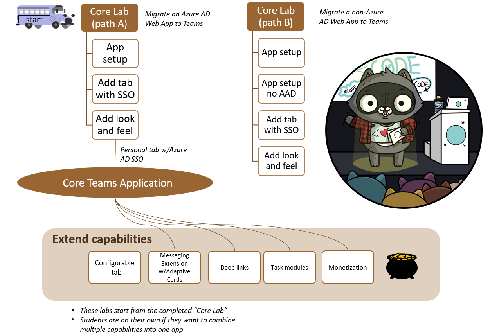

# Microsoft Teams App Camp 2022

Microsoft Teams App Camp is in-fact a virtual camping trip ⛺, where you will learn the basic needed to get your application into Microsoft Teams. And if you are feeling a little adventurous, we have curated some fun adventures for you to extend your application's capabilities.

In this series of labs, you will port a simple "Northwind Orders" web application to become a full-fledged Microsoft Teams application. To make the app understandable by a wide audience, it is written in vanilla JavaScript with no UI framework, however it does use modern browser capabilities such as web components, CSS variables, and ECMAScript modules. The server side is also in JavaScript, using Express, the most popular web server platform for NodeJS.

## Activity packs 📚

This hands-on experience will lead developers through the steps needed to take an existing SaaS app from "zero Microsoft" to a complete Microsoft Teams app running in the Teams.
And extend it to have many capabilities including your journey to reach the Teams app store!

- Core application development (This will be our base camp 🏕️)
- Extending the core application with other capabilities (These are stand alone adventures 🥾)

## Routes 🛣️

There are two routes for doing the core application development labs:

* The "A" path is for developers with apps that are already based on Azure Active Directory. The starting app uses Azure Active Directory and the Microsoft Authentication Library (MSAL).
**[START HERE](./lab-instructions/aad/A01-begin-app.md) for the "A" path**

* the "B" path is for developers with apps that use some other identity system. It includes a simple (and not secure!) cookie-based auth system based on the Employees table in the Northwind database. You will use an identity mapping scheme to allow your existing users to log in directly or via Azure AD Single Sign-On.
**[START HERE](./lab-instructions/bespoke/B01-begin-app.md) for the "B" path**

You can also take up any or all adventures which is of your interest which are basically other capabilities you can build on top of your core teams application:

1. Add a configurable tab so your app works in group chats and Teams channels
2. Add a messaging extension with adaptive cards
3. Use Microsoft Graph, a task module, and deep linking to initiate a chat with a business user
4. Install a sample licensing service and App Source simulator and add licensing to your app to learn about app monetization

> For your adventures, make sure you complete your core teams application lab.

Links to resources referenced throughout App Camp can be found [here, on the Resources page](./docs/Resources.md).

## Packing list 📃 

This lab is intended for developers. Most of the labs don't assume a lot of specialized knowledge; coding is  in JavaScript without use of specialized frameworks or libraries. But if you're not comfortable with coding, you may find it a bit challenging.

Technical prerequisites are explained [in the repo wiki](https://github.com/OfficeDev/m365-msteams-northwind-app-samples/wiki/Prerequisites)

## Contributing

This project welcomes contributions and suggestions.  Most contributions require you to agree to a
Contributor License Agreement (CLA) declaring that you have the right to, and actually do, grant us
the rights to use your contribution. For details, visit https://cla.opensource.microsoft.com.

When you submit a pull request, a CLA bot will automatically determine whether you need to provide
a CLA and decorate the PR appropriately (e.g., status check, comment). Simply follow the instructions
provided by the bot. You will only need to do this once across all repos using our CLA.

This project has adopted the [Microsoft Open Source Code of Conduct](https://opensource.microsoft.com/codeofconduct/).
For more information see the [Code of Conduct FAQ](https://opensource.microsoft.com/codeofconduct/faq/) or
contact [opencode@microsoft.com](mailto:opencode@microsoft.com) with any additional questions or comments.

## Trademarks

This project may contain trademarks or logos for projects, products, or services. Authorized use of Microsoft 
trademarks or logos is subject to and must follow 
[Microsoft's Trademark & Brand Guidelines](https://www.microsoft.com/en-us/legal/intellectualproperty/trademarks/usage/general).
Use of Microsoft trademarks or logos in modified versions of this project must not cause confusion or imply Microsoft sponsorship.
Any use of third-party trademarks or logos are subject to those third-party's policies.
