# Extend Teams app to other M365 host apps like Outlook, Office.com


## Summary

This sample is a created  using the core teams application built over the course of labs [A01](../../lab-instructions/aad/A01-begin-app.md)-[A03](../../lab-instructions/aad/A03-after-apply-styling.md) to get to the Northwind Orders core application. The app demonstrates how to use the latest Microsoft Teams JS SDK V2 to extend teams application to other M365 host apps like Outlook/Office.com


## Version history

Version|Date|Author|Comments
-------|----|----|--------
1.0|April 2022|Bob German, Tomomi Imura, Rabia Williams|Initial release
1.1|April 2022|Rabia Williams|Use Teams JS SDK v2

## Disclaimer

**THIS CODE IS PROVIDED *AS IS* WITHOUT WARRANTY OF ANY KIND, EITHER EXPRESS OR IMPLIED, INCLUDING ANY IMPLIED WARRANTIES OF FITNESS FOR A PARTICULAR PURPOSE, MERCHANTABILITY, OR NON-INFRINGEMENT.**

---

## Minimal Path to Awesome

###  Authorize Microsoft Teams to log users into your application

- Register an application in Azure Active Directory so you can

Microsoft Teams provides a Single Sign-On (SSO) capability so users are silently logged into your application using the same credentials they used to log into Microsoft Teams. This requires giving Microsoft Teams permission to issue Azure AD tokens on behalf of your application. In this exercise, you'll provide that permission.


Go to the [Azure AD admin portal](https://aad.portal.azure.com/) and make sure you're logged in as the administrator of your development tenant. Click "Azure Active Directory" 1️⃣ and then "App Registrations" 2️⃣.

- You will be shown a list of applications (if any) registered in the tenant. Select "+ New Registration" at the top to register a new application.

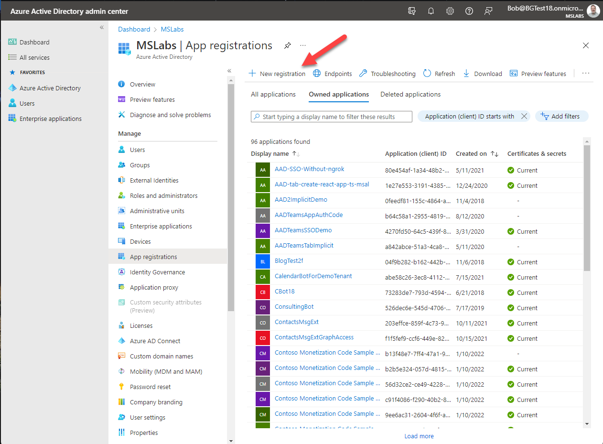

You will be presented with the "Register an application" form.

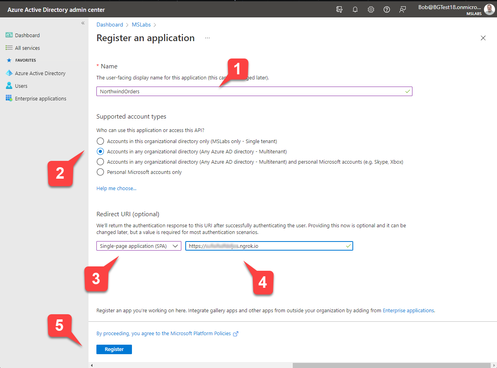

- Enter a name for your application 1️⃣.
- Under "Supported account types" select "Accounts in any organizational directory" 2️⃣. This will allow your application to be used in your customer's tenants.
- Under "Redirect URI", select "Single-page application (SPA)" 3️⃣ and enter the ngrok URL you saved earlier 4️⃣.
- Select the "Register" button 5️⃣

You will be presented with the application overview. There are two values on this screen you need to copy for use later on; those are the Application (client) ID 1️⃣ and the Directory (tenant) ID 2️⃣.

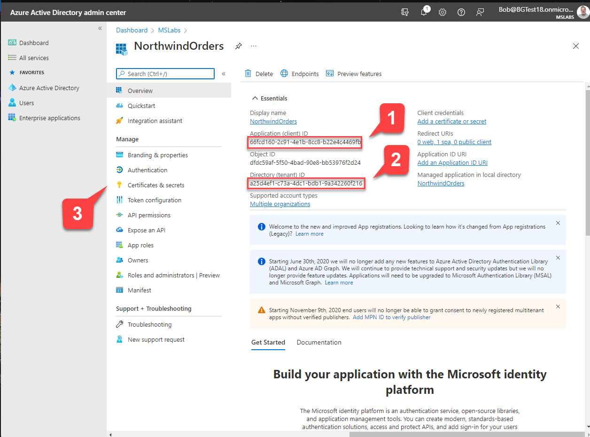

When you've recorded these values, navigate to "Certificates & secrets" 3️⃣.

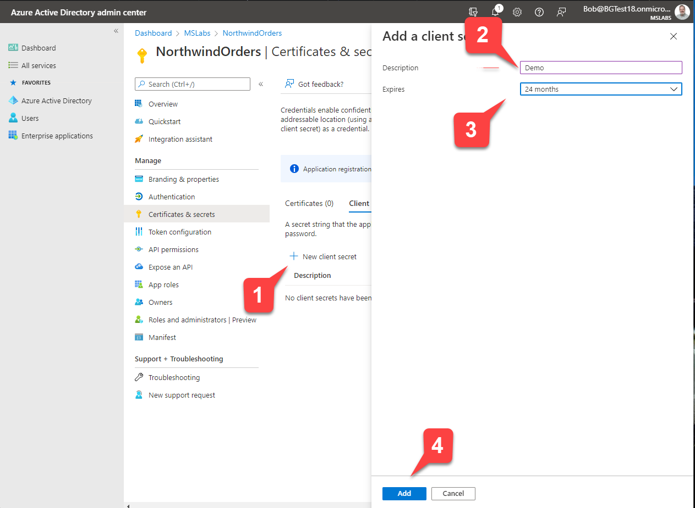

Now you will create a client secret, which is like a password for your application to use when it needs to authenticate with Azure AD.

- Select "+ New client secret" 1️⃣
- Enter a description 2️⃣ and select an expiration date 3️⃣ for your secret 
- Select "Add" to add your secret. 4️⃣

The secret will be displayed just this once on the "Certificates and secrets" screen. Copy it now and store it in a safe place.

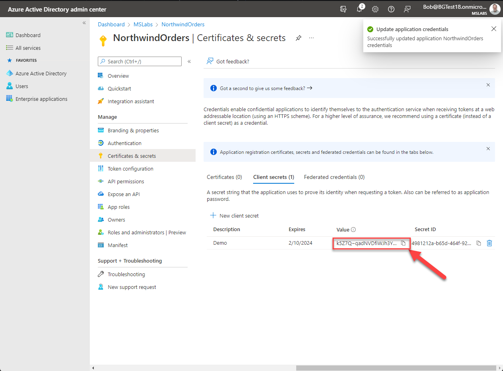


---
😎 MANAGING APP SECRETS IS AN ONGOING RESPONSIBILITY. App secrets have a limited lifetime, and if they expire your application may stop working. You can have multiple secrets, so plan to roll them over as you would with a digital certificate.

---
😎 KEEP YOUR SECRETS SECRET. Give each developer a free developer tenant and register their apps in their tenants so each developer has his or her own app secrets. Limit who has access to app secrets for production. If you're running in Microsoft Azure, a great place to store your secrets is [Azure KeyVault](https://azure.microsoft.com/en-us/services/key-vault/). You could deploy an app just like this one and store sensitive application settings in Keyvault. See [this article](https://docs.microsoft.com/en-us/azure/app-service/app-service-key-vault-references?WT.mc_id=m365-58890-cxa) for more information.

---

- Grant your application permission to call the Microsoft Graph API

The app registration created an identity for your application; now we need to give it permission to call the Microsoft Graph API. The Microsoft Graph is a RESTful API that allows you to access data in Azure AD and Microsoft 365, including Microsoft Teams.

- While still in the app registration, navigate to "API Permissions" 1️⃣ and select "+ Add a permission" 2️⃣.

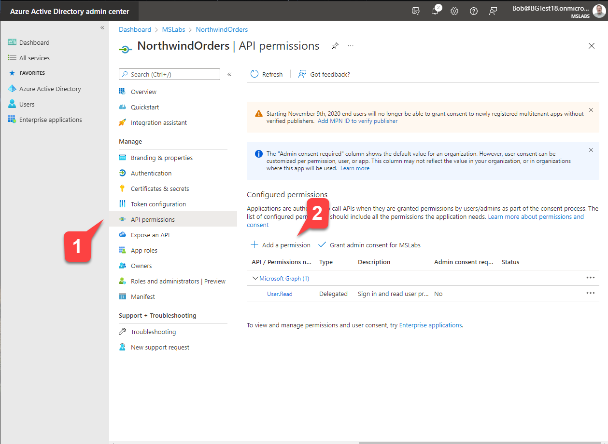

On the "Request API permissions" flyout, select "Microsoft Graph". It's hard to miss!

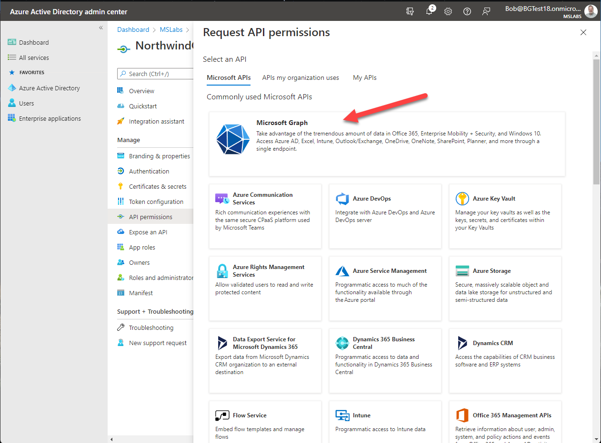

Notice that the application has one permission already: delegated permission User.Read permission for the Microsoft Graph. This allows the logged in user to read his or her own profile. 

The Northwind Orders application uses the Employee ID value in each users's Azure AD profile to locate the user in the Employees table in the Northwind database. The names probably won't match unless you rename them but in a real application the employees and Microsoft 365 users would be the same people.

So the application needs to read the user's employee ID from Azure AD. It could use the delegated User.Read permission that's already there, but to allow elevation of privileges for other calls it will use application permission to read the user's employee ID. For an explanation of application vs. delegated permissions, see [this documentation](https://docs.microsoft.com/en-us/azure/active-directory/develop/v2-permissions-and-consent#permission-types?WT.mc_id=m365-58890-cxa) or watch [this video](https://www.youtube.com/watch?v=SaBbfVgqZHc)

Select "Application permissions" to add the required permission.

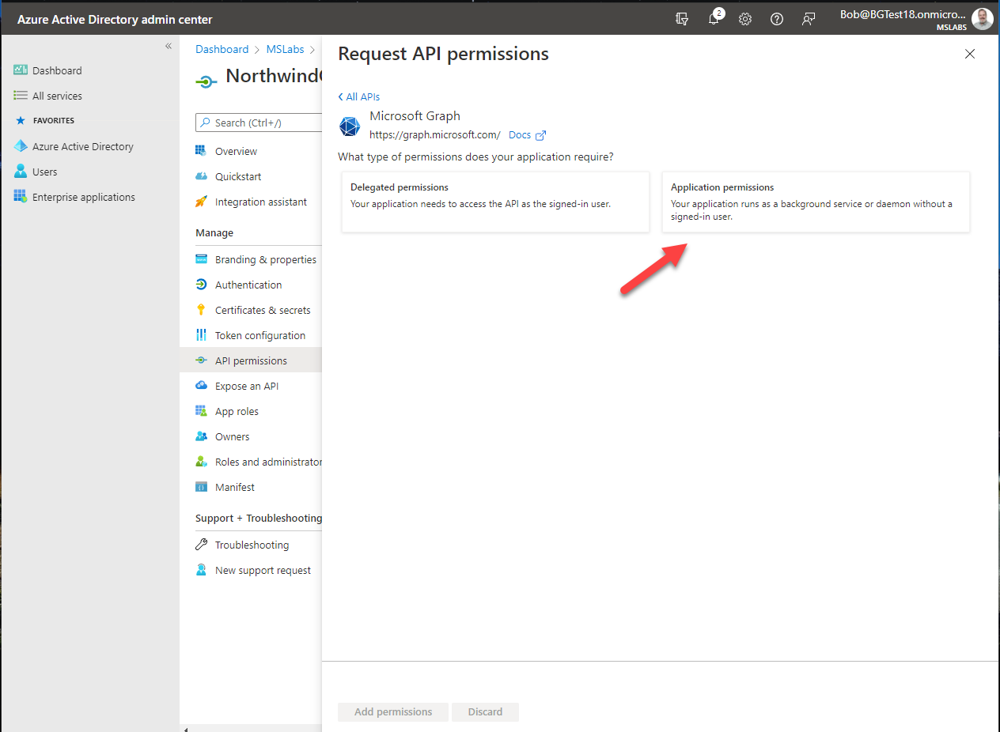

You will be presented with a long list of objects that the Microsoft Graph can access. Scroll all the way down to the User object, open the twistie 1️⃣, and check the "User.Read.All" permission 2️⃣. Select the "Add Permission" button 3️⃣.

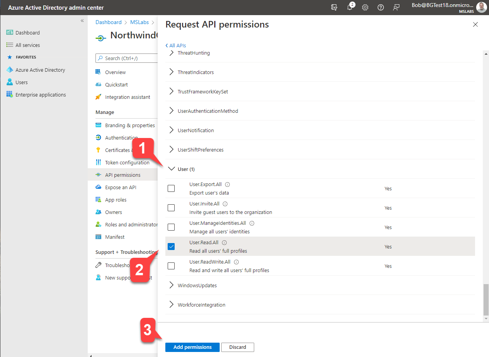

- Consent to the permission

You have added the permission but nobody has consented to it. If you return to the permission page for your app, you can see that the new permission has not been granted. 1️⃣ To fix this, select the "Grant admin consent for <tenant>" button and then agree to grant the consent 2️⃣. When this is complete, the message "Granted for <tenant>" should be displayed for each permission.

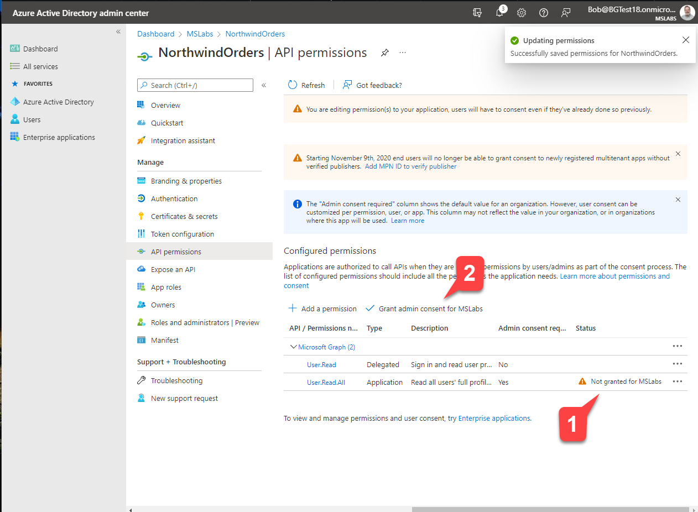

- Expose an API

The Northwind Orders app is a full stack application, with code running in the web browser and web server. The browser application accesses data by calling a web API on the server side. To allow this, we need to expose an API in our Azure AD application. This will allow the server to validate Azure AD access tokens from the web browser.

Select "Expose an API" 1️⃣ and then "Add a scope"2️⃣. Scopes expose an application's permissions; what you're doing here is adding a permission that your application's browser code can use it when calling the server. 

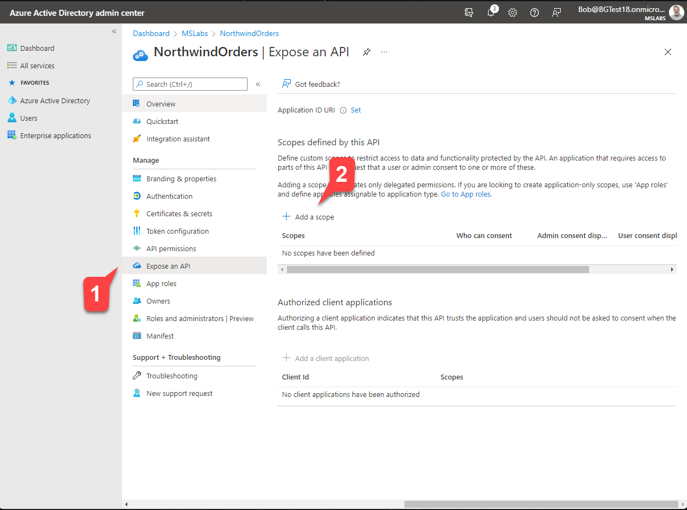

On the "Add a scope" flyout, edit the Application ID URI to include your ngrok URL between the "api://" and the client ID. Select the "Save and continue" button to proceed.

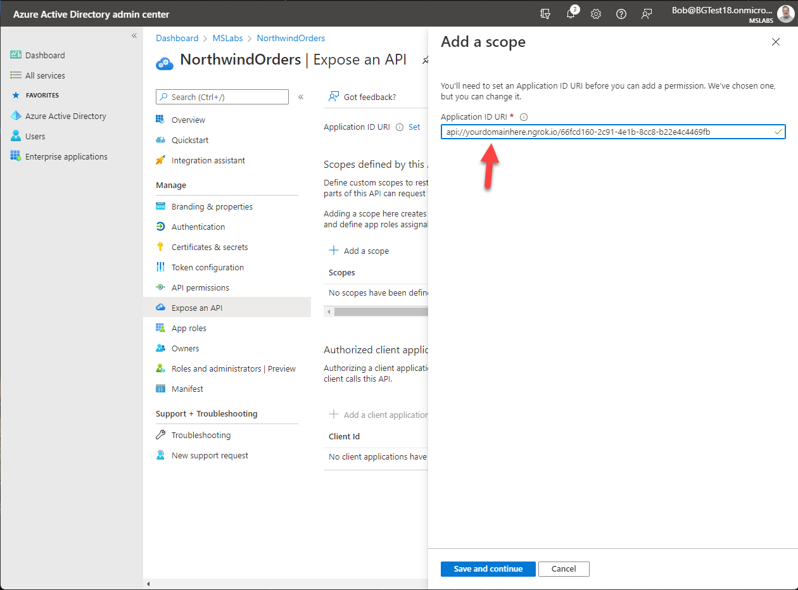

Now that you've defined the application URI, the "Add a scope" flyout will allow you to set up the new permission scope. Fill in the form as follows:
- Scope name: access_as_user
- Who can consent: Admins only
- Admin consent display name: Access as the logged in user
- Admin consent description: Access Northwind services as the logged in user
- (skip User consent fields)
- Ensure the State is set to "Enabled"
- Select "Add scope"

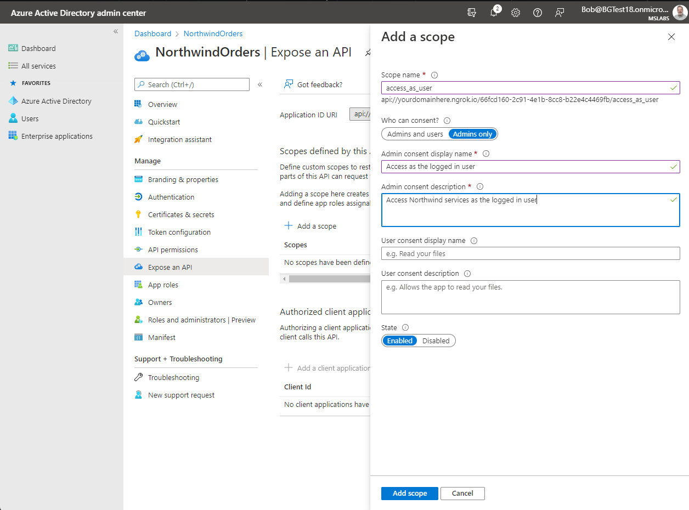


- Add the Teams client applications

Click "Expose an API" 1️⃣ and then "+ Add a client application" 2️⃣.

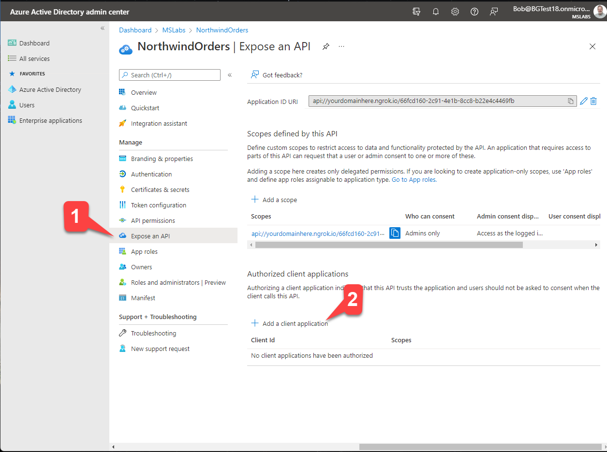

Paste the ID for the Teams mobile or desktop app, `1fec8e78-bce4-4aaf-ab1b-5451cc387264` into the flyout 1️⃣ and check the scope you created earlier 2️⃣ to allow Teams to issue tokens for that scope. Then click "Add application" 3️⃣ to save your work.


Repeat the process for other M365 client applications [see here](https://docs.microsoft.com/en-us/microsoftteams/platform/m365-apps/extend-m365-teams-personal-tab?tabs=manifest-teams-toolkit#update-azure-ad-app-registration-for-sso)

|Microsoft 365 client application|	Client ID|
|---|---|
|Teams desktop, mobile|	1fec8e78-bce4-4aaf-ab1b-5451cc387264|
|Teams web	|5e3ce6c0-2b1f-4285-8d4b-75ee78787346|
|Office.com|	4765445b-32c6-49b0-83e6-1d93765276ca|
|Office desktop|	0ec893e0-5785-4de6-99da-4ed124e5296c|
|Outlook desktop|	d3590ed6-52b3-4102-aeff-aad2292ab01c|
|Outlook Web Access|	00000002-0000-0ff1-ce00-000000000000|
|Outlook Web Access	|bc59ab01-8403-45c6-8796-ac3ef710b3e3|

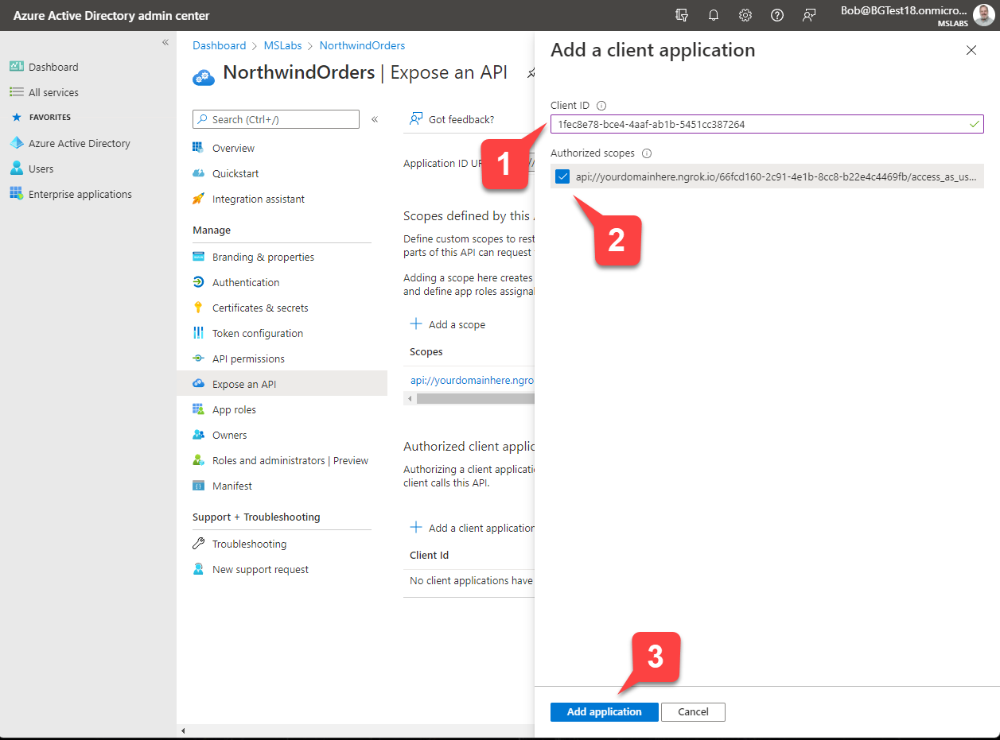

### Project set up
- Clone or download the sample from [https://github.com/OfficeDev/m365-msteams-northwind-app-samples](https://github.com/OfficeDev/m365-msteams-northwind-app-samples)

- In a console, navigate to `src/extend-with-capabilities/ExtendTeamsForM365/` from the main folder `m365-msteams-northwind-app-samples`.

    ```bash
    cd src/extend-with-capabilities/ExtendTeamsForM365/
    ```

- Install modules

    ```bash
    npm install
    ```

- Run ngrok - point to port 3978

    ```bash
    ngrok http -host-header=rewrite 3978
    ```

- Update the `.env` configuration 

Update the env file with the below values:

```
COMPANY_NAME=Northwind Traders
PORT=3978

TEAMS_APP_ID=<any GUID>
HOSTNAME=<Your ngrok url>
TENANT_ID=<Your tenant id>
CLIENT_ID=<client id from AAD app registration>
CLIENT_SECRET=<client secret from AAD app registration>
CONTACTS=<Any user/users you'd like to chat/mail for orders. Comma separated if more than one user>
```
### Create Northwind DB local files

Run below script to download local DB files

    ```bash
    npm run db-download
    ```

### Package & upload app

- Package the app

    ```bash
    npm run package
    ```

- Run the app locally
    ```bash
    npm start
    ```

- Upload the the packaged zip file inside `manifest` folder into Teams [using these instructions](https://docs.microsoft.com/en-us/microsoftteams/platform/concepts/deploy-and-publish/apps-upload).

## Test the app

- Launch application in Teams


- Launch application in Office.com


- Launch application in Outlook


## Features
- In Teams:
    - My Orders
    - My Orders Report
    - Order details
    - Open chat with sales representatives from **Order details page**
    
- In Office.com:
    - My Recent Order
    - My Recent Files
    - Order details
- In Outlook (Windows):
    - My Orders
    - Order details
    - Compose mail to sales representatives from **Order details page**
- In Outlook (Web):
    - My Orders
    - Order details