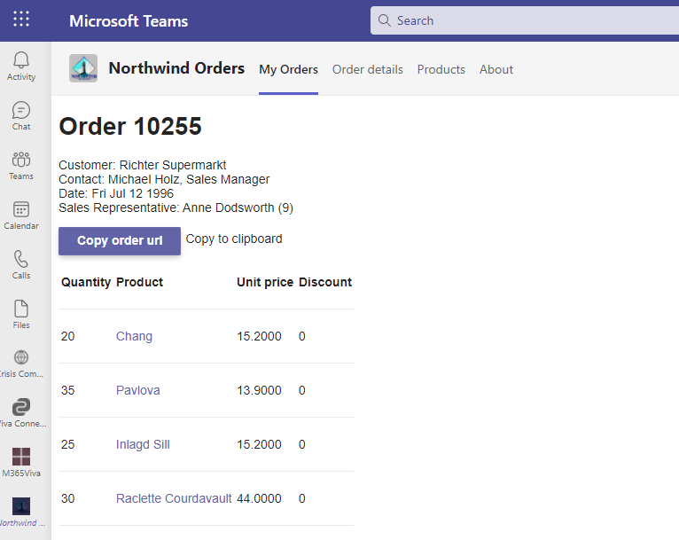

## Add a Deep link to a personal Tab

This lab is part of extending with capabilities for your teams app which begins with a Northwind Orders core application using the `aad` path.
> Complete labs [A01](A01-begin-app.md)-[A03](A03-after-apply-styling.md) to get to the Northwind Orders core application

Deep links help the user to directly navigate to the content.
In this lab we will create deep link to entities in Teams so the user can navigate to contents within the app's tab.

In this exercise you will learn new concepts as below:

- [Deep links](https://docs.microsoft.com/en-us/microsoftteams/platform/concepts/build-and-test/deep-links?WT.mc_id=m365-58890-cxa)


### How to build the deep link for this lab.

In this lab we will focus on creating a deep link within a static personal tab.
We will introduce a new tab in the personal tab app called `Order details`.

> `Order details` tab is just added only to show how deeplinking works

Now using th syntax below, we will create the link

```
https://teams.microsoft.com/l/entity/<app-id>/<entitiyId>?context={"subEntityId": "<subEntityId>"}
```

- **app-id** - This teams app id from the manifest file
- **entityId** - This is defined in your manifest file in the `staticTabs` object for the particular entity (tab).
- **subEntityId** - This is the ID for the item you are displaying information for. This is similar to query parameters. In our case in this lab, it will be the orderId.


### Features

- In the application's order details page, add a button to copy the order's tab link into clipboard, that helps users share the link via chat or outlook to colleague, for them to navigate easily to that specific order.


### Exercise 1: Code changes
---

#### Step 1: Update existing files


**1. client\page\orderDetail.html**

Let's add the copy to clipboard button and a div to display a message to show if the copy was successful.

Add below block of code and paste it above `orderDetails` div element.

```javascript
<div id="copySection" style="display: none;">
<div> <button id="btnCopyOrderUrl">Copy order url</button></div>
    <div style="flex-grow: 1;padding:5px;" id="copyMessage">Copy to clipboard</div>
</div> 
```

**2. client\page\orderDetail.js**
 
Import the teams SDK module as well as the new function to get teams app Id.

Paste below code above the displayUI() function definition.

```javascript
import 'https://statics.teams.cdn.office.net/sdk/v1.11.0/js/MicrosoftTeams.min.js';

```

Replace the displayUI() function with below definition:

```javascript
async function displayUI() {
    const displayElement = document.getElementById('content');
    const detailsElement = document.getElementById('orderDetails');
    const copyUrlElement = document.getElementById('btnCopyOrderUrl');
    const copyMsgElement=document.getElementById('copyMessage');
    const copySectionElement=document.getElementById('copySection');
    const errorMsgElement=document.getElementById('message');
    try {

        const searchParams = new URLSearchParams(window.location.search);        
        microsoftTeams.initialize(async () => {
        microsoftTeams.getContext(async (context)=> {      
     
        if (searchParams.has('orderId')||context.subEntityId) {
            const orderId = searchParams.get('orderId')?searchParams.get('orderId'):context.subEntityId;
            const order = await getOrder(orderId);
            displayElement.innerHTML = `
                    <h1>Order ${order.orderId}</h1>
                    <p>Customer: ${order.customerName}<br />
                    Contact: ${order.contactName}, ${order.contactTitle}<br />
                    Date: ${new Date(order.orderDate).toDateString()}<br />
                    ${order.employeeTitle}: ${order.employeeName} (${order.employeeId})
                    </p>
                `;

            order.details.forEach(item => {
                const orderRow = document.createElement('tr');
                orderRow.innerHTML = `<tr>
                        <td>${item.quantity}</td>
                        <td><a href="/pages/productDetail.html?productId=${item.productId}">${item.productName}</a></td>
                        <td>${item.unitPrice}</td>
                        <td>${item.discount}</td>
                    </tr>`;
                detailsElement.append(orderRow);

            });
            if(searchParams.has('orderId')){
                copySectionElement.style.display = "flex";
                copyUrlElement.addEventListener('click', async ev => {
                    try { 
                        //temp textarea for copy to clipboard functionality
                        var textarea = document.createElement("textarea");
                        const encodedContext = encodeURI(`{"subEntityId": "${order.orderId}"}`);
                        const appId=await getTeamsAppId();     
                        //form the deeplink
                        const deeplink = `https://teams.microsoft.com/l/entity/${appId}/OrderDetails?&context=${encodedContext}`;
                        textarea.value = deeplink;
                        document.body.appendChild(textarea);
                        textarea.select();
                        document.execCommand("copy"); //deprecated but there is an issue with navigator.clipboard api
                        document.body.removeChild(textarea); 
                        copyMsgElement.innerHTML="Link copied!"
                    
                    } catch (err) {
                        console.error('Failed to copy: ', err);
                      }});
            }else{
                copySectionElement.style.display = "none";
               
            }
        }else{
            errorMsgElement.innerText = `No order to show`;
            displayElement.style.display="none";
            orderDetails.style.display="none";
        }
    });
});
       
    }
    catch (error) {            // If here, we had some other error
        errorMsgElement.innerText = `Error: ${JSON.stringify(error)}`;
    }
}
```

We will use Microsoft Teams SDK to get the current context through which we can get the entityId and userId of the current user in the personal tab they are in.
That is why we use below lines of code to initialize and get context from teams
```javascript
microsoftTeams.initialize(async () => {
microsoftTeams.getContext(async (context)=> {      
     
```

If the tab is opened using a query parameter (as done in the core lab) **OR**
there is an **subEntityId** then, get the order details and display. We are reusing the page `orderDetails` to be a tab in the personal app which takes the order id as the **subEntityId** which is a similar idea to query parameters.


In the `copyUrlElement.addEventListener()` what goes on is explained next.

The new tab is the entity and it's **entityId** will be defined in the manifest file (In the next section), the entityId here is `OrderDetails`.
This enables the teams application to understand which tab (entityId) is to be opened and what parameter(subEntityId) is to be passed to display information.

**4. manifest\manifest.template.json**

Add a new static tab entry in the manifest to show the order details to navigate using the deeplink.
Paste below code after `Orders`

```json
{
      "entityId": "OrderDetails",
      "name": "Order details",
      "contentUrl": "https://<HOSTNAME>/pages/orderDetail.html",
      "websiteUrl": "https://<HOSTNAME>/pages/orderDetail.html",
      "scopes": [
        "personal"
      ]
    },
```
Finished manifest looks like this:
<pre>
{
  "$schema": "https://developer.microsoft.com/en-us/json-schemas/teams/v1.8/MicrosoftTeams.schema.json",
  "manifestVersion": "1.8",
  "version": "1.9.0",
  "id": "&lt;TEAMS_APP_ID&gt;",
  "packageName": "io.github.officedev.teamsappcamp1.northwind",
  "developer": {
    "name": "Northwind Traders",
    "websiteUrl": "https://&lt;HOSTNAME&gt;/",
    "privacyUrl": "https://&lt;HOSTNAME&gt;/privacy.html",
    "termsOfUseUrl": "https://&lt;HOSTNAME&gt;/termsofuse.html"
  },
  "icons": {
      "color": "northwind192.png",
      "outline": "northwind32.png"
  },
  "name": {
    "short": "Northwind Orders",
    "full": "Northwind Traders Order System"
  },
  "description": {
    "short": "Sample enterprise app using the Northwind Traders sample database",
    "full": "Simple app to demonstrate porting a SaaS app to Microsoft Teams"
  },
  "accentColor": "#FFFFFF",
  "configurableTabs": [
    {
        "configurationUrl": "https://&lt;HOSTNAME&gt;/pages/tabConfig.html",
        "canUpdateConfiguration": true,
        "scopes": [
            "team",
            "groupchat"
        ]
    }
],
"staticTabs": [
    {
      "entityId": "Orders",
      "name": "My Orders",
      "contentUrl": "https://&lt;HOSTNAME&gt;/pages/myOrders.html",
      "websiteUrl": "https://&lt;HOSTNAME&gt;/pages/myOrders.html",
      "scopes": [
        "personal"
      ]
    },
<b>
    {
      "entityId": "OrderDetails",
      "name": "Order details",
      "contentUrl": "https://&ltHOSTNAME&gt;/pages/orderDetail.html",
      "websiteUrl": "https://&ltHOSTNAME&gt;/pages/orderDetail.html",
      "scopes": [
        "personal"
      ]
    },
</b>
    {
      "entityId": "Products",
      "name": "Products",
      "contentUrl": "https://&lt;HOSTNAME&gt;/pages/categories.html",
      "websiteUrl": "https://&lt;HOSTNAME&gt;/pages/categories.html",
      "scopes": [
        "personal"
      ]
    }
  ],
  "showLoadingIndicator": false,
  "permissions": [
      "identity",
      "messageTeamMembers"
  ],
  "validDomains": [
      "&lt;HOSTNAME&gt;"
  ],
  "webApplicationInfo": {
      "id": "&lt;CLIENT_ID&gt;",
      "resource": "api://&lt;HOSTNAME>/&lt;CLIENT_ID&gt;"
  }
}
</pre>

Update the version number so it's greater than it was; for example if your manifest was version 1.4, make it 1.4.1 or 1.5.0. This is required in order for you to update the app in Teams.

~~~json
"version": "1.5.0"
~~~

### Exercise 2: Test the changes
---
Now that you have applied all code changes, let's test the features.

#### Step 1 : Create new teams app package
Make sure the env file is configured as per the sample file .env_Sample.
Create updated teams app package by running below script:
```nodejs
npm run package
```

#### Step 2: Start your local project

Now it's time to run your updated application and run it in Microsoft Teams. Start the application by running below command: 

```nodejs
npm start
```

#### Step 3: Upload the app package to Teams

In the Teams web or desktop UI, click "Apps" in the sidebar 1️⃣, then "Manage your apps" 2️⃣. At this point you have three choices:

* Upload a custom app (upload the app for yourself or a specific team or group chat) - this only appears if you have enabled "Upload custom apps" in your setup policy; this was a step in the previous lab
* Upload an app to your org's app catalog (upload the app for use within your organization) - this only appears if you are a tenant administrator
* Submit an app to your org (initiate a workflow asking a tenant administrator to install your app) - this appears for everyone

In this case, choose the first option 3️⃣.


Navigate to the Northwind.zip file in your manifest directory and upload it. 
The Teams client will display the application information, add the application to a team or a group chat.


#### Step 4 : Run the application in Teams client

Once you are in the application, go to `My orders` page and select any order.
Select **Copy order url**.


On selection, the message next to button changes from *Copy to clipboard* to *Link copied!*


Login as another user who has Northwind Order app installed in their teams.
Open the link in the browser. It should open in the personal tab with the order information displayed.



