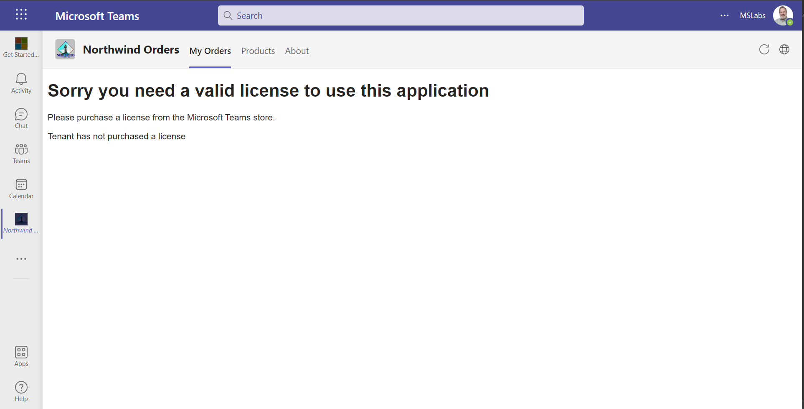
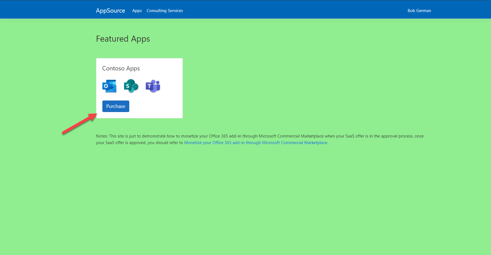
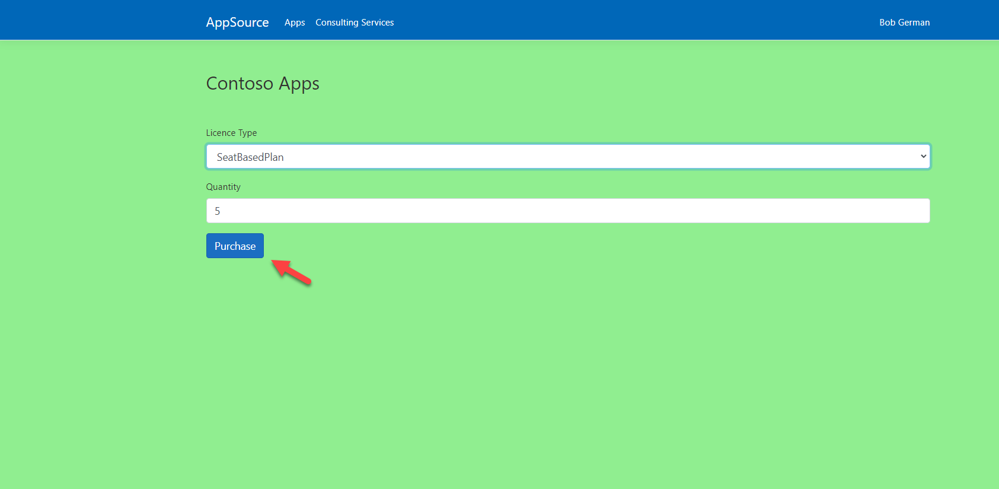
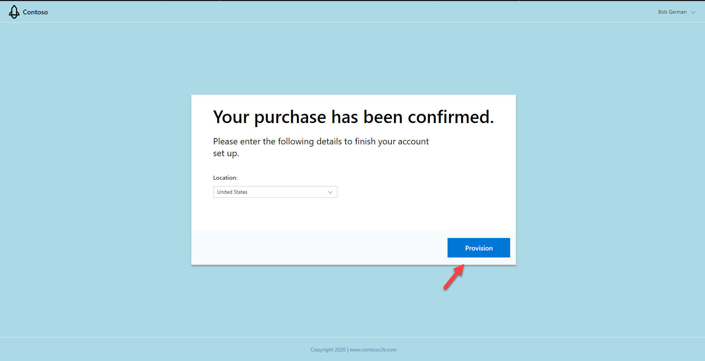
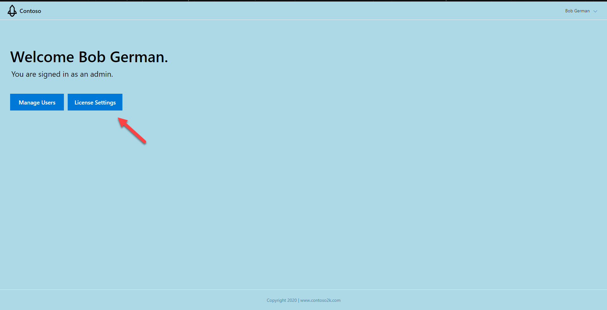
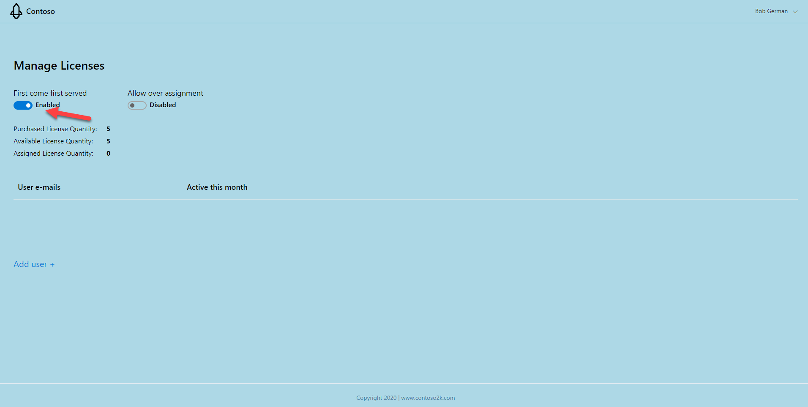
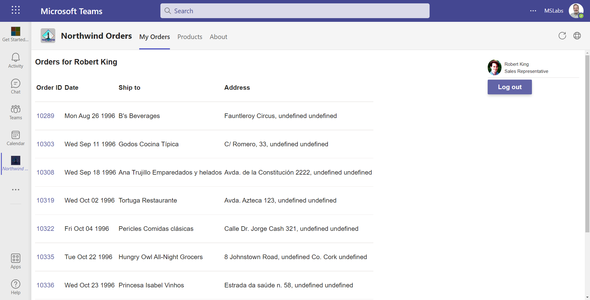
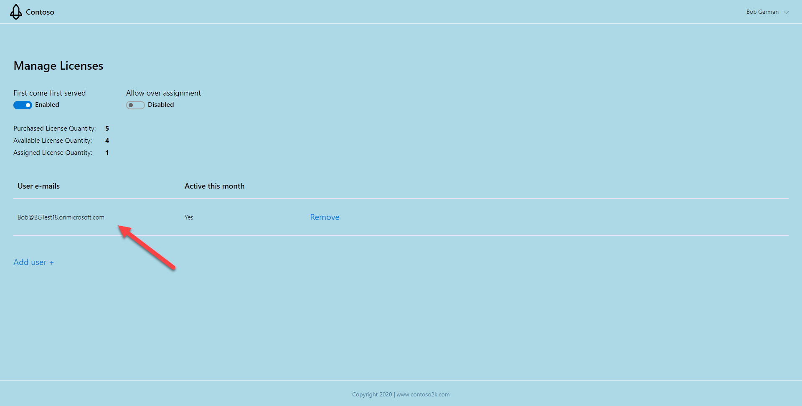

# Selling Your SaaS-based Teams Extension

There are variants of this lab, depending on the prerequisites you have access to. The labs are as follows.

1. I do not have an Azure subscription or a Partner Center subscription. (📍You are here)
2. I have an Azure subscription, but no Partner Center subscription. [Go here](./Monetization-2.md)
3. I have an Azure subscription and a Partner Center subscription. (Coming soon)

This lab is part of extending with capabilities for your teams app which begins with a Northwind Orders core application using the `AAD` path.

> Complete labs [A01](A01-begin-app.md)-[A03](A03-after-apply-styling.md) to get the Northwind Orders core application ready for this lab.

## Overview

Here you will set up your Northwind Orders application as a transactable offer in a mock AppSource marketplace, since you don't have a Partner Center account which is required to create offers in the real AppSource. Additionally, you will integrate the Northwind Orders application with a simple licensing service that allows you to purchase licenses for your SaaS application.

When you are done the Northwind Orders application will require a license to run in Teams, but will not require a license when accessing it directly.

## Exercise 1: Update .env

Your `.env` file on the Northwind Orders application needs to be updated to include values that will allow it to interact with the licensing service. This service is centrally located and you share it with the other lab participants. 

1. Go back to the `A01-begin-app` directory you worked in for **Labs A01-A03**.
2. Add below entries into `.env` file.

```text
SAAS_API=https://(webApiSiteName).azurewebsites.net/api/Subscriptions/CheckOrActivateLicense
SAAS_SCOPES=api://(webApiClientId)/user_impersonation
OFFER_ID=contoso_o365_addin
```

You must replace the values `webApiSiteName` and `webApiClientId` with values that point at the shared systems. These values are not included here as the repository is public to the Internet. 

3. Please ask your lab proctor for these values.
4. Replace the values in your `.env` file.

## Exercise 2: Northwind Orders calls the licensing service

In this exercise, you will update the Northwind Orders app to call the licensing service.

### Step 1: Add server side code to validate the user has a license

1. In your working folder, create a new file `/server/validateLicenseService.js` 
2. Paste in the following code (or copy the file from [here](../../src/extend-with-capabilities/Monetization/server/northwindLicenseService.js)).

~~~javascript
import aad from 'azure-ad-jwt';
import fetch from 'node-fetch';

export async function validateLicense(thisAppAccessToken) {

    const audience = `api://${process.env.HOSTNAME}/${process.env.CLIENT_ID}`;
    return new Promise((resolve, reject) => {

        aad.verify(thisAppAccessToken, { audience: audience }, async (err, result) => {
            if (result) {
                const licensingAppUrl = `${process.env.SAAS_API}/${process.env.OFFER_ID}`
                const licensingAppAccessToken = await getOboAccessToken(thisAppAccessToken);
                if (licensingAppAccessToken === "interaction_required") {
                    reject({ "status":401, "message": "Interaction required"});
                }
                
                const licensingResponse = await fetch(licensingAppUrl, {
                    method: "POST",
                    headers: {
                        "Accept": "application/json",
                        "Content-Type": "application/json",
                        "Authorization" :`Bearer ${licensingAppAccessToken}`
                    }
                });
                if (licensingResponse.ok) {
                    const licensingData = await licensingResponse.json();
                    console.log(licensingData.reason);
                    resolve(licensingData);
                } else {
                    reject({ "status": licensingResponse.status, "message": licensingResponse.statusText });
                }
            } else {
                reject({ "status": 401, "message": "Invalid client access token in northwindLicenseService.js"});
            }
        });
    });

}

// TODO: Securely cache the results of this function for the lifetime of the resulting token
async function getOboAccessToken(clientSideToken) {

    const tenantId = process.env.TENANT_ID;
    const clientId = process.env.CLIENT_ID;
    const clientSecret = process.env.CLIENT_SECRET;
    const scopes = process.env.SAAS_SCOPES;

    // Use On Behalf Of flow to exchange the client-side token for an
    // access token with the needed permissions
    
    const INTERACTION_REQUIRED_STATUS_TEXT = "interaction_required";
    const url = "https://login.microsoftonline.com/" + tenantId + "/oauth2/v2.0/token";
    const params = {
        client_id: clientId,
        client_secret: clientSecret,
        grant_type: "urn:ietf:params:oauth:grant-type:jwt-bearer",
        assertion: clientSideToken,
        requested_token_use: "on_behalf_of",
        scope: scopes
    };

    const accessTokenQueryParams = new URLSearchParams(params).toString();
    try {
        const oboResponse = await fetch(url, {
            method: "POST",
            body: accessTokenQueryParams,
            headers: {
                Accept: "application/json",
                "Content-Type": "application/x-www-form-urlencoded"
            }
        });

        const oboData = await oboResponse.json();
        if (oboResponse.status !== 200) {
            // We got an error on the OBO request. Check if it is consent required.
            if (oboData.error.toLowerCase() === 'invalid_grant' ||
                oboData.error.toLowerCase() === 'interaction_required') {
                throw (INTERACTION_REQUIRED_STATUS_TEXT);
            } else {
                console.log(`Error returned in OBO: ${JSON.stringify(oboData)}`);
                throw (`Error in OBO exchange ${oboResponse.status}: ${oboResponse.statusText}`);
            }
        }
        return oboData.access_token;
    } catch (error) {
        return error;
    }

}
~~~

### Step 2: Add a server side API to validate the user's license

Now that you have code that checks the user's license on the server side, you need to add a POST request to the the Northwind Orders application that calls the licensing service API.

1. In your working folder, locate the file `server/server.js` and open it in your code editor.
2. Add these lines to the top of the file.

~~~javascript
import aad from 'azure-ad-jwt';
import { validateLicense } from './validateLicenseService.js';
~~~

3. Immediately below the call to `await initializeIdentityService()`, add the following code.

~~~javascript
// Web service validates a user's license
app.post('/api/validateLicense', async (req, res) => {

  try {
    const token = req.headers['authorization'].split(' ')[1];

    try {
      let hasLicense = await validateLicense(token);
      res.send(JSON.stringify({ "validLicense" : hasLicense }));
    }
    catch (error) {
      console.log (`Error ${error.status} in validateLicense(): ${error.message}`);
      res.status(error.status).send(error.message);
    }
  }
  catch (error) {
      console.log(`Error in /api/validateAadLogin handling: ${error}`);
      res.status(500).json({ status: 500, statusText: error });
  }

});
~~~

### Step 3: Add client pages to display a license error

The app needs to be able to show if there is a licensing error. This step adds that code to the client.

1. Add a new file, `client/pages/needLicense.html`. 
2. Paste in the following HTML (or copy the file from [here](../../src/extend-with-capabilities/Monetization/client/pages/needLicense.html)).

~~~html
<!doctype html>
<html>

<head>
    <meta charset="UTF-8" />
    <title>Northwind Privacy</title>
    <link rel="icon" href="data:;base64,="> <!-- Suppress favicon error -->
    <link rel="stylesheet" href="/northwind.css" />
   
</head>

<body class="ms-Fabric" dir="ltr">   
    <h1>Sorry you need a valid license to use this application</h1>
    <p>Please purchase a license from the Microsoft Teams store.       
    </p>
    <div id="errorMsg"></div>
    <script type="module" src="needLicense.js"></script>
</body>

</html>
~~~

The HTML page needs some JavaScript to work properly.

3. Create a file `/client/pages/needLicense.js`.
4. Paste in the following code (or copy the file from [here](../../src/extend-with-capabilities/Monetization/client/pages/needLicense.js)).

```javascript
const searchParams = new URLSearchParams(window.location.search);
if (searchParams.has('error')) {
    const error = searchParams.get('error');
    const displayElementError = document.getElementById('errorMsg');
    displayElementError.innerHTML = error;  
}
```

### Step 4: Check if the user has a license

In this step, you will add client side function to check if the user has a license.

1. Add a new file, `client/modules/northwindLicensing.js`.
2. Paste in the following code (or copy the file from [here](../../src/extend-with-capabilities/Monetization/client/modules/northwindLicensing.js)). 

This code calls the server-side API we just added using an Azure AD token obtained using Microsoft Teams SSO.

~~~javascript
import 'https://statics.teams.cdn.office.net/sdk/v1.11.0/js/MicrosoftTeams.min.js';

export async function hasValidLicense() {

    await new Promise((resolve, reject) => {
        microsoftTeams.initialize(() => { resolve(); });
    });

    const authToken = await new Promise((resolve, reject) => {
        microsoftTeams.authentication.getAuthToken({
            successCallback: (result) => { resolve(result); },
            failureCallback: (error) => { reject(error); }
        });
    });

    const response = await fetch(`/api/validateLicense`, {
        "method": "post",
        "headers": {
            "content-type": "application/json",
            "authorization": `Bearer ${authToken}`
        },
        "cache": "no-cache"
    });
   
    if (response.ok) {

        const data = await response.json();
        return data.validLicense;

    } else {

        const error = await response.json();
        console.log(`ERROR: ${error}`);

    }
}
~~~

### Step 5: Call the license API

In this step, you'll add client side code that checks the user's license on every request.

1. Open the file `client/identity/userPanel.js` in your code editor. 
    This is a web component that displays the user's picture and name on every page, so it's an easy place to check the license.
2. Add this line at the top of the file.

~~~javascript
import { hasValidLicense } from '../modules/northwindLicensing.js';
~~~

3. Add the following code in the `else` clause within the `connectedCallback()` function.

~~~javascript
    if (await inTeams()) {
        const validLicense = await hasValidLicense();  
        if (validLicense.status && validLicense.status.toString().toLowerCase()==="failure") {
                window.location.href =`/pages/needLicense.html?error=${validLicense.reason}`;
        }    
    }
~~~

The completed `userPanel.js` should look like the following code.

~~~javascript
import {
    getLoggedInEmployee,
    logoff
} from './identityClient.js';
import { inTeams } from '../modules/teamsHelpers.js';
import { hasValidLicense } from '../modules/northwindLicensing.js';

class northwindUserPanel extends HTMLElement {

    async connectedCallback() {

        const employee = await getLoggedInEmployee();

        if (!employee) {

            logoff();

        } else {

            if (await inTeams()) {
                const validLicense = await hasValidLicense();  
                if (validLicense.status && validLicense.status.toString().toLowerCase()==="failure") {
                     window.location.href =`/pages/needLicense.html?error=${validLicense.reason}`;
                }    
            }

            this.innerHTML = `<div class="userPanel">
                </img>
                <p>${employee.displayName}</p>
                <p>${employee.jobTitle}</p>
                <hr />
                <button id="logout">Log out</button>
            </div>
            `;

            const logoutButton = document.getElementById('logout');
            logoutButton.addEventListener('click', async ev => {
                logoff();
            });
        }
    }
}

// Define the web component and insert an instance at the top of the page
customElements.define('northwind-user-panel', northwindUserPanel);
const panel = document.createElement('northwind-user-panel');
document.body.insertBefore(panel, document.body.firstChild);
~~~

> 📃 **NOTE:** There are many ways to make the license check more robust, such as checking it on every web service call and caching this on the server side to avoid excessive calls to the licensing server. However this is just a lab so we wanted to keep it simple.

## Exercise 3: Run the application

Now that all the pieces are in place, it's time to run the application you've set up.

### Step 1: Run Teams without a license

In this initial step, you'll run the application without a user license to see how the application behaves.

1. Ensure your NW Trader Orders application is running with the new code you just added.
2. Return to your application in Microsoft Teams.
3. Refresh the tab or browser if necessary. 
   The UI will begin to render, and then it will detect the license failure and display an error page.



> 📃 **NOTE:** The sample application checks the license in JavaScript, which is convenient for this lab but it would be easy for someone to bypass the license check. In a real application you'd probably check the license on all accesses to your application web site.

### Step 2: Purchase a subscription and set licensing policy

In a real-world situation, your SaaS offer is listed in the **Teams Store**and the **Microsoft AppSource marketplace**. Users can purchase your app in either location. 

For this lab you will use an **AppSource** simulator to mock your interactions with the actual marketplace. Just know that Teams users can purchase apps directly from the user interface when they're listed in the Teams app store.

1. Get the mock AppSource website URL from your lab proctor.

2. Browse to mock AppSource URL. This should display the **AppSource** simulator. 

> 📃**NOTE:** The **AppSource** simulator's background color is green to make it easy to distinguish from your app's landing page, which has a blue background.

3. Click the **Purchase** button to purchase a subscription to the Northwind Orders application.



> 📃 **NOTE:** The **AppSource** simulator has a mock offer name, "Contoso Apps", rather than showing the "Northwind Orders" app. This is just a constant defined in the monetization project's `SaasOfferMockData/Offers.cs` file.
> 
> The real **AppSource** web page shows the application name and other information you would configure in Partner Center.

The **AppSource** simulator displays the plans available for the offer. The simulator has two hard-coded plans, "SeatBasedPlan" (which uses a [per-user pricing model](https://docs.microsoft.com/en-us/azure/marketplace/create-new-saas-offer-plans)), and a "SiteBasedPlan" (which uses a [flat-rate pricing model](https://docs.microsoft.com/en-us/azure/marketplace/plan-saas-offer?WT.mc_id=m365-58890-cxa#saas-pricing-models)). 

The real **AppSource** would show the plans you had defined in Partner Center, the publisher's portal for defining and publishing **AppSource** offers.

Microsoft Teams currently supports only the per-user pricing model

4. Select the "SiteBasedPlan" and click the **Purchase** button. Because this is a simulator, your credit card will not be charged.



The simulated purchase is now complete, so you will be redirected to the app's landing page. 

You will need to supply a page like this as part of your application; it interprets a token sent by **AppSource** and logs the user in with AAD SSO. This token is then sent to the **SaaS Fulfillment API v2**, which provides the details of the customer's subscription. 

The landing page gives the app a chance to interact with the user and capture any configuration information it needs. Users who purchase the app in the Teams store would be brought to this same page. The sample app's landing page allows the user to select a region; the app stores this information in its own database.



Once the region is selected, the sample app shows a welcome page with the user's name, which is obtained by [reading the user's profile with the Microsoft Graph API](https://docs.microsoft.com/en-us/graph/api/user-get?view=graph-rest-1.0&WT.mc_id=m365-58890-cxa). 

5. Click **License Settings** to view the license assignment screen.



On this screen you can add individual user licenses using the **Add User** button, or you can set a policy that allows users to claim licenses on a first come, first served basis. Turn on the **First come first served** switch to enable this option.



> 📃**NOTE:** Everything on this screen is defined by this application. It's intended to be flexible since publishers have a wide range of licensing approaches. Apps can tell who's logging in via Azure AD and use the user ID and tenant ID to authorize access, provide personalization, etc.

### Step 3: Run the application in Teams

Now that you've purchased a subscription, you can see the Northwind Orders application in Teams.

1. Return to Microsoft Teams and refresh your application. 
    The license will be approved and the user can interact with the application normally.



2. Return to the licensing application.
   
   If you've closed the tab, you can find it at the mock AppSource URL you received earlier. 



Notice that your username has been assigned a license. The sample app stored this in a SQL Server database. When the Teams application called the licensing service, the access token contained the tenant ID and user ID, enabling the licensing service to determine that the user has a license.

## Lab feedback

For the latest issues, or to file a bug report, see the [github issues list](https://github.com/OfficeDev/m365-msteams-northwind-app-samples/issues) for this repository.

## Next steps

After completing this lab, you may continue with any of the following labs.

- [Add a Configurable Tab](./ConfigurableTab.md)
- [Add a Deep link to a personal Tab](./Deeplink.md)
- [Add Messaging Extension](./MessagingExtension.md)
- [Add a Task Module](TaskModules.md)