# Selling Your SaaS-based Teams Extension

This lab is part of extending with capabilities for your teams app which begins with a Northwind Orders core application using the `AAD` path.

> Complete labs [A01](A01-begin-app.md)-[A03](A03-after-apply-styling.md) to get the Northwind Orders core application ready for this lab.

In this lab you will perform four exercises.

<!-- no toc -->
- [Selling Your SaaS-based Teams Extension](#selling-your-saas-based-teams-extension)
  - [Features added in this lab](#features-added-in-this-lab)
  - [Lab prerequisites](#lab-prerequisites)
  - [Exercise 1: Download and install](#exercise-1-download-and-install)
    - [Step 1: Install the prerequisites](#step-1-install-the-prerequisites)
    - [Step 2:  Download the source code needed to be deployed](#step-2--download-the-source-code-needed-to-be-deployed)
  - [Exercise 2:  Deploy with an ARM template](#exercise-2--deploy-with-an-arm-template)
    - [Step 1](#step-1)
    - [Step 2: Deploy the ARM template with PowerShell](#step-2-deploy-the-arm-template-with-powershell)
    - [Step 3: Deploy server side code](#step-3-deploy-server-side-code)
    - [Step 4: Update .env file with deployed resources.](#step-4-update-env-file-with-deployed-resources)
  - [Exercise 2: Grant the Northwind Orders app permission to call the licensing service in Azure](#exercise-2-grant-the-northwind-orders-app-permission-to-call-the-licensing-service-in-azure)
    - [Step 1: Return to the Northwind Orders app registration](#step-1-return-to-the-northwind-orders-app-registration)
    - [Step 2: Add permission to call the licensing application](#step-2-add-permission-to-call-the-licensing-application)
    - [Step 2A (ONLY IF NEEDED): Add permission across tenants](#step-2a-only-if-needed-add-permission-across-tenants)
    - [Step 3: Consent to the permission](#step-3-consent-to-the-permission)
  - [Exercise 3: Update the Northwind Orders app to call the licensing service in Azure](#exercise-3-update-the-northwind-orders-app-to-call-the-licensing-service-in-azure)
    - [Step 1: Add a server side function to validate the user has a license](#step-1-add-a-server-side-function-to-validate-the-user-has-a-license)
    - [Step 2: Add a server side API to validate the user's license](#step-2-add-a-server-side-api-to-validate-the-users-license)
    - [Step 3: Add client side pages to display a license error](#step-3-add-client-side-pages-to-display-a-license-error)
    - [Step 4: Add client side function to check if the user has a license](#step-4-add-client-side-function-to-check-if-the-user-has-a-license)
    - [Step 5: Add client side call to check the license on every request](#step-5-add-client-side-call-to-check-the-license-on-every-request)
  - [Exercise 4: Run the application](#exercise-4-run-the-application)
    - [Step 1: Run the app in Teams without a license](#step-1-run-the-app-in-teams-without-a-license)
    - [Step 2: "Purchase" a subscription and set licensing policy](#step-2-purchase-a-subscription-and-set-licensing-policy)
    - [Step 3: Run the application in Teams](#step-3-run-the-application-in-teams)
  - [Known issues](#known-issues)
  - [Next steps](#next-steps)


1. Deploy the App Source simulator and sample SaaS fulfillment and licensing service in Microsoft Azure so you can test it
2. Observe the interactions between App Source and a SaaS landing page in a simulated environment
3. Connect the Northwind Orders application to the sample SaaS licensing service to enforce licenses for Microsoft Teams users

## Features added in this lab

- **App Source simulator** enabling a customer can "purchase" a subscription to your application
- **Sample web service** that fulfills this purchase and manages licenses for Microsoft Teams users to use the Northwind Orders application
- **Northwind Orders application** checks to ensure Microsoft Teams users are licensed or displays an error page

## Lab prerequisites

This lab requires the following prerequisites.

1. An active Azure subscription on your own Azure tenant.
2. An active M365 tenant, which can be the one you created in the prerequisites lab.
3. PowerShell 7 (This is cross-platform and will run on MacOS and Linux)
4. .NET Core 3.1 SDK (This is cross-platform and will run on MacOS and Linux)
5. .NET Framework 4.8 Developer Pack

**OPTIONAL:** If you want to run or modify these applications locally, you may find the following tools helpful.

- [Visual Studio 2022](https://visualstudio.microsoft.com/vs/) for Windows. The free **Community** edition will work fine.

**Note:** During installation, select the following modules to be added to Visual Studio.

1. ASP.NET and web development
2. Azure development
3. Office/SharePoint development
4. .NET cross-platform development

### Install the prerequisites

1. Install [PowerShell 7](https://github.com/PowerShell/PowerShell/releases/tag/v7.1.4)
2. Install the following PowerShell modules (You will need an elevated prompt)
    - [Microsoft Graph PowerShell SDK](https://github.com/microsoftgraph/msgraph-sdk-powershell#powershell-gallery) 

      ```powershell
      Install-Module Microsoft.Graph -AllowClobber -Force
      ```

     - [Azure Az PowerShell module](https://docs.microsoft.com/en-us/powershell/azure/install-az-ps?view=azps-6.4.0&WT.mc_id=m365-58890-cxa#installation)

        ```powershell
        Install-Module -Name Az -Scope CurrentUser -Repository PSGallery -AllowClobber -Force
        ```
3. Install [.NET Core 3.1 SDK](https://dotnet.microsoft.com/download/dotnet/3.1)
4. [.NET Framework 4.8 Developer Pack](https://dotnet.microsoft.com/download/dotnet-framework/thank-you/net48-developer-pack-offline-installer)

## Exercise 1: Download source code for lab

To complete this lab you'll deploy the following to Azure. 

- Northwind Web App - The Northwind SaaS application
- License Service Web API - An API that serves as a licensing service
- AppSource Simulator - An application that simulates the AppSource 
- SQL Server and database

You'll create the three applications and their supporting infrastructure using automated deployment scripts called [ARM templates](https://docs.microsoft.com/en-us/azure/azure-resource-manager/templates/overview).

**Download the source code needed for these services**

1. Go to [https://github.com/OfficeDev/office-add-in-saas-monetization-sample](https://github.com/OfficeDev/office-add-in-saas-monetization-sample).
2. Clone or download the project to your local machine.

## Exercise 2:  Deploy resources to Azure

In this exercise you will deploy resources into your Azure subscription using an ARM template. These resources will all share the same resource group. They include the three web applications and a SQL server instance with a database.

### Step 1

- In the project you just downloaded in Exercise 1, Step 2, go to folder `office-add-in-saas-monetization-sample/Deployment_SaaS_Resources/` in your text editor.
- Open the `ARMParameters.json` file and update the following parameters with values you choose.
    
    ```text
        - webAppSiteName
        - webApiSiteName
        - resourceMockWebSiteName
        - domainName
        - directoryId (Directory (tenant) ID)
        - sqlAdministratorLogin
        - sqlAdministratorLoginPassword
        - sqlMockDatabaseName
        - sqlSampleDatabaseName
    ```

Leave the rest of the configuration in file `ARMParameters.json` as is, this will be automatically filled in after scripts deploy the resources.
 
1. Enter a unique name for each web app and web site in the parameter list shown below because each one must have a unique name across all of Azure.  All of the parameters that correspond to web apps and sites in the following list end in **SiteName**.
    > For **domainName** and **directoryId**, please refer to this [article](https://docs.microsoft.com/en-us/partner-center/find-ids-and-domain-names?WT.mc_id=m365-58890-cxa#find-the-microsoft-azure-ad-tenant-id-and-primary-domain-name) to find your Microsoft Azure AD tenant ID and primary domain name.

    > Based on the subscription you are using, you may change the location where your azure resources are deployed. To change this, find the `DeployTemplate.ps1` file and search for variable `$location`.
    By default it is `centralus` but you can change it to `eastus`.
2. In a Powershell 7 window, change to the **.\Deployment_SaaS_Resources** directory.
3. Run the following command. You will be prompted to sign in and accept a **Permissions requested** dialog as shown below.
    ```powershell
    Connect-Graph -Scopes "Application.ReadWrite.All, Directory.AccessAsUser.All DelegatedPermissionGrant.ReadWrite.All Directory.ReadWrite.All"
    ```

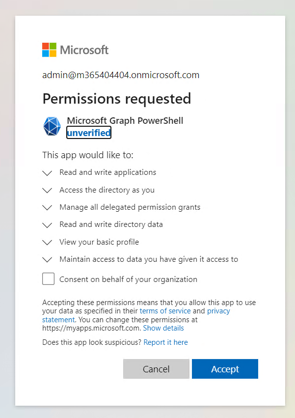

4. Click **Accept**.

Once accepted, the browser will redirect and show the below message. You can now close the browser and continue with the PowerShell command line.

 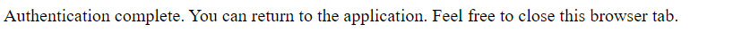

5. In the same PowerShell terminal window run `.\InstallApps.ps1`.

    > This step adds `Microsoft Graph PowerShell` in Azure Active Directory under [Enterprise Applications](https://docs.microsoft.com/en-us/azure/active-directory/manage-apps/add-application-portal?WT.mc_id=m365-58890-cxa) with the necessary permissions so we can create the needed applications for this particular exercise using its commands.
     
⚠️ You might get an error as shown below. And it depends on the execution policy settings in the machine. If you do get the error, move to Step 2. If you do not get the error keep going.

 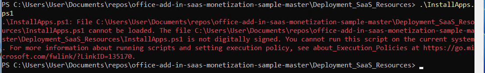

6. Copy the values from the output and later you will need  these values to update the code and .env file for deploying Add-ins. These values will also be pre-populated in `ARMParameters.json`. Do not change this file.
7. Notice how the `ARMParameters.json` file is now updated with the values of applications deployed.
8. Since you did not get the PowerShell error, [move to Step 3](#step-3-deploy-the-arm-template-with-powershell).

### Step 2: Overcoming install errors

⚠️ **This step is only needed if the previous step ended in an error.**

The error you experienced above is likely due to the execution policy of your PowerShell terminal. Here you will set the PowerShell execution policy to be less restrictive and then re-run the install script.

You will set the execution policy to `Bypass` for now. Read more on execution policies [here](https://docs.microsoft.com/en-us/powershell/module/microsoft.powershell.security/set-executionpolicy?view=powershell-7.2&WT.mc_id=m365-58890-cxa).

1. Run below PowerShell command.
    ```powershell
    Set-ExecutionPolicy -Scope Process -ExecutionPolicy Bypass
    ```
2. Now re-run `.\InstallApps.ps1`

    The script should now run to create all three applications in Azure AD. At the end of the script, your command line should display below information.:

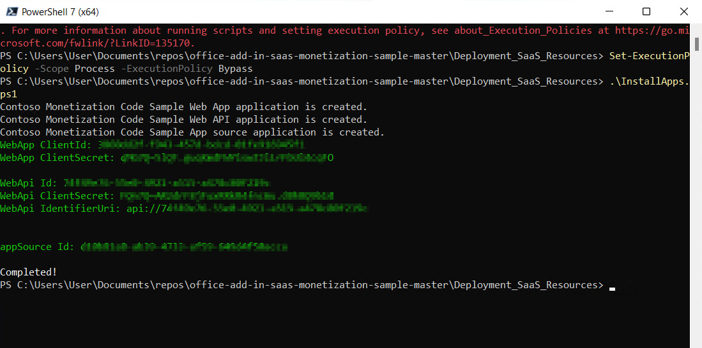

3. Copy the values from the output and later you will need  these values to update the code and .env file for deploying Add-ins. These values will also be pre-populated in `ARMParameters.json`. Do not change this file.
4. Notice how the `ARMParameters.json` file is now updated with the values of applications deployed.

### Step 3: Deploy the ARM template with PowerShell

1. Open PowerShell 7 and run the Powershell command `Connect-AzAccount`. This will redirect you to login page.
2. Confirm with the Global admin credentials. You will be redirected to a page displaying below.


3. Close the browser and continue with PowerShell. You will see similar output to that shown below in your command line, if everything is okay.

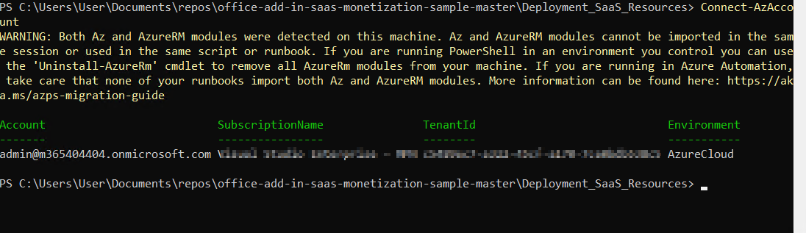

4. Run the script `.\DeployTemplate.ps1`. 
    When prompted, enter the name of the resource group to create.

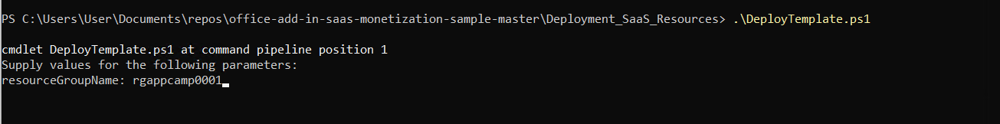

Your resources will start to get deployed one after the other and you'll see the output as shown below if everything is okay.


You'll get a message on the command line that the ARM Template deployment was successfully as shown below.

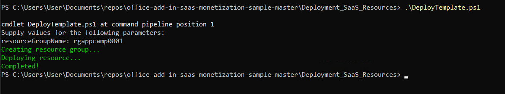

5. Go to the `App registrations` in Azure AD in Azure portal. Use this [link](https://portal.azure.com/#blade/Microsoft_AAD_IAM/ActiveDirectoryMenuBlade/RegisteredApps) to navigate to it.

Under **All applications**,  filter with Display name `Contoso Monetization`.
You should see three apps as shown in the screen below:

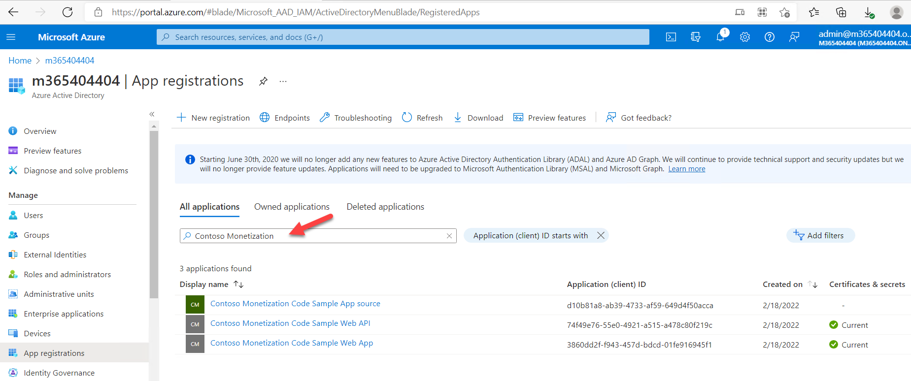

### Step 4: Deploy server side code

Here you'll deploy the server side code for these three applications.

1. In the command line, change to the `.\MonetizationCodeSample` directory.
2. Run the script `.\PublishSaaSApps.ps1`.
3. When prompted, enter the same resource group name.
    You will see the source code in your local machine getting built and packaged.

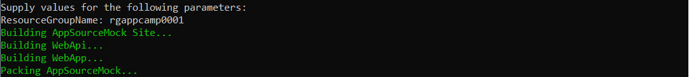

> **Note:** You may see some warnings about file expiration, please ignore.

The final messages may look like the image below.

 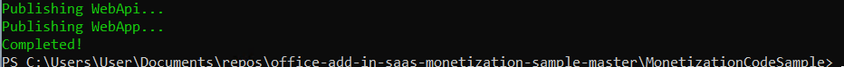

You just created a website that emulates the **AppSource** online store for the purposes of these labs.

### Step 5: Update .env file with deployed resources.

1. Go back to the `A01-begin-app` directory you worked in for Labs A01-A03.
2. Add below entries into `.env` file. 
    ```
    SAAS_API=https://(webApiSiteName).azurewebsites.net/api/Subscriptions/CheckOrActivateLicense
    SAAS_SCOPES=api://(webApiClientId)/user_impersonation
    OFFER_ID=contoso_o365_addin
    ```
3. Replace the values &lt;webApiSiteName&gt; and &lt;webApiClientId&gt; with the values from your `ARMParameters.json` file.
4. Try visiting the App Source simulator, which is at `https://(webAppSiteName).azurewebsites.net`; you should be able to log in using your tenant administrator account. **Don't** purchase a subscription yet, however!

## Exercise 3: Grant the Northwind Orders app permission to call the licensing service in Azure

In this exercise and the next, you will connect the Northwind Orders application to the sample licensing service you just installed. This will allow you to simulate purchasing the Northwind Orders application in the **App Source simulator** and enforcing the licenses in Microsoft Teams.

The licensing web service is secured using Azure AD, so in order to call it the Northwind Orders app will acquire an access token to call the licenisng service on behalf of the logged in user.

### Step 1: Return to the Northwind Orders app registration

Return to the [Azure AD admin portal](https://aad.portal.azure.com/) and make sure you're logged in as the administrator of your development tenant. Click "Azure Active Directory" 1️⃣ and then "App Registrations" 2️⃣.

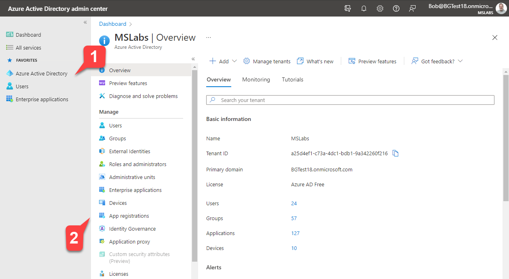

Select the app you registered earlier to view the application overview.

### Step 2: Add permission to call the licensing application

In the left navigation, click "API permissions" 1️⃣ and then "+ Add a permission" 2️⃣.

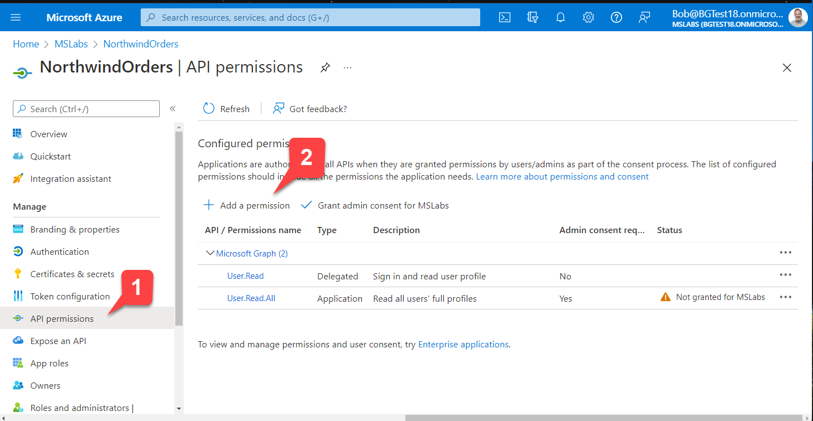

In the flyout, select the "My APIs" tab 1️⃣ and then find the licensing service you installed earlier in this lab and click on it. By default, it will be called the "Contoso Monetization Code Sample Web API" 2️⃣. If you can't find it, you probably installed the licensing service in another tenant. No problem - just skip to Step 2A below.

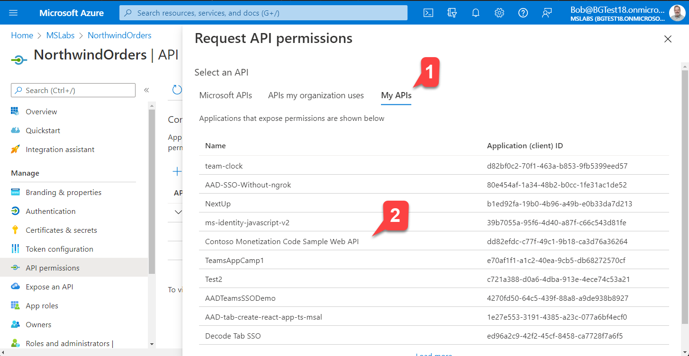

Now select "Delegated permissions" 1️⃣ and the one scope exposed by the licensing web API, "user_impersonation", will be displayed. 

Check this permission 2️⃣ and click "Add permissions" 3️⃣.

### Step 2A (ONLY IF NEEDED): Add permission across tenants

> If you were able to complete Step 2, then you don't need this; move on to Step 3.
> 
> If, in the course of doing Step 2, you are unable to find the licensing service, then it's probably registered in a different tenant (different Azure AD instance). No worries - now you get to learn how to set up a cross-tenant consent!

 * First, navigate to the Azure AD app registration for the licensing service. Click "Authentication" and then "+ Add a platform". Choose the "web" platform and enter `http://localhost` as the Redirect URI. This will allow the administrator of your M365 tenant to log in using a web browser just for the purpose of consent. In a real application, you would create a web page that acknowledges the consent instead of using http://localhost, which will send the admin to an error page but only after doing the initial consent.

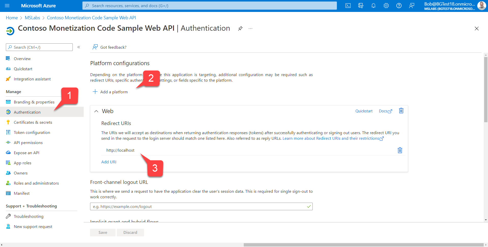

* Construct a URL as follows: 
 
    ```url
    https://login.microsoftonline.com/<m365-tenant-id>/adminconsent?client_id=<license-service-client-id>&redirect_uri=http://localhost
    ```

Substitute your M365 tenant ID and the license service client ID (from the other tenant) in this URL and browse there. Log in using your M365 admin account and agree to the consent. 

**NOTE:** When you're done, the browser will redirect you to http://localhost, **which probably won't work**, so just close the browser and move on!

* You have just created an Enterprise Application (a.k.a. Service Principal) for the licensing service in the M365 tenant. You should now be able to complete Step 2.

### Step 3: Consent to the permission

You have added the permission but nobody has consented to it. Fortunately you're an administrator and can grant your consent from this same screen! Just click the "Grant admin consent for <tenant>" button 1️⃣ and then agree to grant the consent 2️⃣. When this is complete, the message "Granted for <tenant>" 3️⃣ should be displayed for each permission.

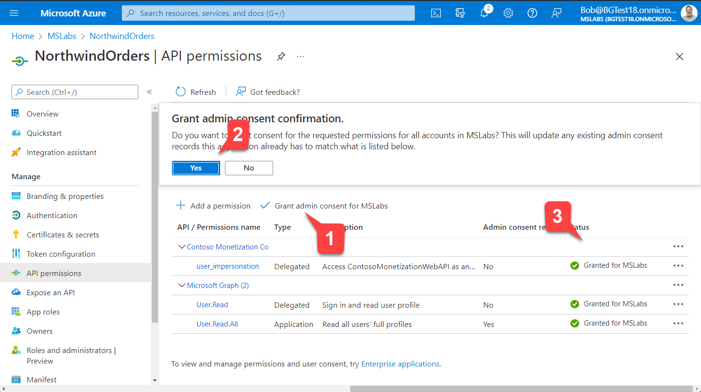

## Exercise 3: Update the Northwind Orders app to call the licensing service in Azure

### Step 1: Add a server side function to validate the user has a license

In your working folder, create a new file `/server/validateLicenseService.js` and paste in this code (or copy the file from [here](../../src/extend-with-capabilities/Monetization/server/northwindLicenseService.js)).

~~~javascript
import aad from 'azure-ad-jwt';
import fetch from 'node-fetch';

export async function validateLicense(thisAppAccessToken) {

    const audience = `api://${process.env.HOSTNAME}/${process.env.CLIENT_ID}`;
    return new Promise((resolve, reject) => {

        aad.verify(thisAppAccessToken, { audience: audience }, async (err, result) => {
            if (result) {
                const licensingAppUrl = `${process.env.SAAS_API}/${process.env.OFFER_ID}`
                const licensingAppAccessToken = await getOboAccessToken(thisAppAccessToken);
                if (licensingAppAccessToken === "interaction_required") {
                    reject({ "status":401, "message": "Interaction required"});
                }
                
                const licensingResponse = await fetch(licensingAppUrl, {
                    method: "POST",
                    headers: {
                        "Accept": "application/json",
                        "Content-Type": "application/json",
                        "Authorization" :`Bearer ${licensingAppAccessToken}`
                    }
                });
                if (licensingResponse.ok) {
                    const licensingData = await licensingResponse.json();
                    console.log(licensingData.reason);
                    resolve(licensingData);
                } else {
                    reject({ "status": licensingResponse.status, "message": licensingResponse.statusText });
                }
            } else {
                reject({ "status": 401, "message": "Invalid client access token in northwindLicenseService.js"});
            }
        });
    });

}

// TODO: Securely cache the results of this function for the lifetime of the resulting token
async function getOboAccessToken(clientSideToken) {

    const tenantId = process.env.TENANT_ID;
    const clientId = process.env.CLIENT_ID;
    const clientSecret = process.env.CLIENT_SECRET;
    const scopes = process.env.SAAS_SCOPES;

    // Use On Behalf Of flow to exchange the client-side token for an
    // access token with the needed permissions
    
    const INTERACTION_REQUIRED_STATUS_TEXT = "interaction_required";
    const url = "https://login.microsoftonline.com/" + tenantId + "/oauth2/v2.0/token";
    const params = {
        client_id: clientId,
        client_secret: clientSecret,
        grant_type: "urn:ietf:params:oauth:grant-type:jwt-bearer",
        assertion: clientSideToken,
        requested_token_use: "on_behalf_of",
        scope: scopes
    };

    const accessTokenQueryParams = new URLSearchParams(params).toString();
    try {
        const oboResponse = await fetch(url, {
            method: "POST",
            body: accessTokenQueryParams,
            headers: {
                Accept: "application/json",
                "Content-Type": "application/x-www-form-urlencoded"
            }
        });

        const oboData = await oboResponse.json();
        if (oboResponse.status !== 200) {
            // We got an error on the OBO request. Check if it is consent required.
            if (oboData.error.toLowerCase() === 'invalid_grant' ||
                oboData.error.toLowerCase() === 'interaction_required') {
                throw (INTERACTION_REQUIRED_STATUS_TEXT);
            } else {
                console.log(`Error returned in OBO: ${JSON.stringify(oboData)}`);
                throw (`Error in OBO exchange ${oboResponse.status}: ${oboResponse.statusText}`);
            }
        }
        return oboData.access_token;
    } catch (error) {
        return error;
    }

}
~~~

In Lab A03, you called the Microsoft Graph API using application permissions. This code calls the licensing service using delegated permissions, meaning that the application is acting on behalf of the user.

To do this, the code uses the [On Behalf Of flow](https://docs.microsoft.com/en-us/azure/active-directory/develop/v2-oauth2-on-behalf-of-flow?WT.mc_id=m365-58890-cxa) to exchange the incoming access token (targeted for the Northwind Orders app) for a new access token that is targeted for the Licensing service application.

### Step 2: Add a server side API to validate the user's license

Now that we have a function that checks the user's license on the server side, we need to add a POST request to our service that calls the function.

In your working folder, locate the file `server/server.js` and open it in your code editor.

Add these lines to the top of the file:

~~~javascript
import aad from 'azure-ad-jwt';
import { validateLicense } from './validateLicenseService.js';
~~~

Now, immediately below the call to `await initializeIdentityService()`, add this code:

~~~javascript
// Web service validates a user's license
app.post('/api/validateLicense', async (req, res) => {

  try {
    const token = req.headers['authorization'].split(' ')[1];

    try {
      let hasLicense = await validateLicense(token);
      res.send(JSON.stringify({ "validLicense" : hasLicense }));
    }
    catch (error) {
      console.log (`Error ${error.status} in validateLicense(): ${error.message}`);
      res.status(error.status).send(error.message);
    }
  }
  catch (error) {
      console.log(`Error in /api/validateAadLogin handling: ${error}`);
      res.status(500).json({ status: 500, statusText: error });
  }

});
~~~

### Step 3: Add client side pages to display a license error

Add a new file, `client/pages/needLicense.html` and paste in this HTML, or copy the file from [here](../../src/extend-with-capabilities/Monetization/client/pages/needLicense.html).

~~~html
<!doctype html>
<html>

<head>
    <meta charset="UTF-8" />
    <title>Northwind Privacy</title>
    <link rel="icon" href="data:;base64,="> <!-- Suppress favicon error -->
    <link rel="stylesheet" href="/northwind.css" />
   
</head>

<body class="ms-Fabric" dir="ltr">   
    <h1>Sorry you need a valid license to use this application</h1>
    <p>Please purchase a license from the Microsoft Teams store.       
    </p>
    <div id="errorMsg"></div>
    <script type="module" src="needLicense.js"></script>
</body>

</html>
~~~

To provide the JavaScript for the new page, create a file `/client/pages/needLicense.js` and paste in this code, or copy the file from [here](../../src/extend-with-capabilities/Monetization/client/pages/needLicense.js).

```javascript
const searchParams = new URLSearchParams(window.location.search);
if (searchParams.has('error')) {
    const error = searchParams.get('error');
    const displayElementError = document.getElementById('errorMsg');
    displayElementError.innerHTML = error;  
}
```

### Step 4: Add client side function to check if the user has a license

Add a new file, `client/modules/northwindLicensing.js` and paste in the following code, or copy the file from [here](../../src/extend-with-capabilities/Monetization/client/modules/northwindLicensing.js). This code calls the server-side API we just added using an Azure AD token obtained using Microsoft Teams SSO.

~~~javascript
import 'https://statics.teams.cdn.office.net/sdk/v1.11.0/js/MicrosoftTeams.min.js';

export async function hasValidLicense() {

    await new Promise((resolve, reject) => {
        microsoftTeams.initialize(() => { resolve(); });
    });

    const authToken = await new Promise((resolve, reject) => {
        microsoftTeams.authentication.getAuthToken({
            successCallback: (result) => { resolve(result); },
            failureCallback: (error) => { reject(error); }
        });
    });

    const response = await fetch(`/api/validateLicense`, {
        "method": "post",
        "headers": {
            "content-type": "application/json",
            "authorization": `Bearer ${authToken}`
        },
        "cache": "no-cache"
    });
   
    if (response.ok) {

        const data = await response.json();
        return data.validLicense;

    } else {

        const error = await response.json();
        console.log(`ERROR: ${error}`);

    }

}
~~~

### Step 5: Add client side call to check the license on every request

Open the file `client/identity/userPanel.js` in your code editor. This is a web component that displays the user's picture and name on every page, so it's an easy place to check the license.

Add this line at the top of the file:

~~~javascript
import { hasValidLicense } from '../modules/northwindLicensing.js';
~~~

Now add this code in the `else` clause within the `connectedCallback()` function:

~~~javascript
    if (await inTeams()) {
        const validLicense = await hasValidLicense();  
        if (validLicense.status && validLicense.status.toString().toLowerCase()==="failure") {
                window.location.href =`/pages/needLicense.html?error=${validLicense.reason}`;
        }    
    }
~~~

The completed `userPanel.js` should look like this:

~~~javascript
import {
    getLoggedInEmployee,
    logoff
} from './identityClient.js';
import { inTeams } from '../modules/teamsHelpers.js';
import { hasValidLicense } from '../modules/northwindLicensing.js';

class northwindUserPanel extends HTMLElement {

    async connectedCallback() {

        const employee = await getLoggedInEmployee();

        if (!employee) {

            logoff();

        } else {

            if (await inTeams()) {
                const validLicense = await hasValidLicense();  
                if (validLicense.status && validLicense.status.toString().toLowerCase()==="failure") {
                     window.location.href =`/pages/needLicense.html?error=${validLicense.reason}`;
                }    
            }

            this.innerHTML = `<div class="userPanel">
                </img>
                <p>${employee.displayName}</p>
                <p>${employee.jobTitle}</p>
                <hr />
                <button id="logout">Log out</button>
            </div>
            `;

            const logoutButton = document.getElementById('logout');
            logoutButton.addEventListener('click', async ev => {
                logoff();
            });
        }
    }
}

// Define the web component and insert an instance at the top of the page
customElements.define('northwind-user-panel', northwindUserPanel);
const panel = document.createElement('northwind-user-panel');
document.body.insertBefore(panel, document.body.firstChild);
~~~

> NOTE: There are many ways to make the license check more robust, such as checking it on every web service call and caching this on the server side to avoid excessive calls to the licensing server, however this is just a lab so we wanted to keep it simple.

## Exercise 4: Run the application

### Step 1: Run the app in Teams without a license

Ensure your NW Trader Orders application is running with the new code you just added.

Return to your application in Microsoft Teams; refresh the tab or browser if necessary. The UI will begin to render, and then it will detect the license failure and display an error page.


>NOTE: The sample application checks the license in JavaScript, which is convenient for this lab but it would be easy for someone to bypass the license check. In a real application you'd probably check the license on all accesses to your application web site.

### Step 2: "Purchase" a subscription and set licensing policy

Teams Store are also listed in the Microsoft App Source portal; users can purchase you app in either location. For this lab you will use an App Source simulator which you installed earlier in this lab, but users can purchase apps directly from the Teams user interface when they're listed in the Teams app store.

Browse to https://(resourceMockWebSiteName).azurewebsites.net where (resourceMockWebSiteName) is the name you chose in Exercise 1 Step 3. This should display the App Source simulator. 

> NOTE: The App Source simulator's background color is green to make it easy to see when you are redirected to your app's landing page, which has a blue background.

Click the "Purchase" button to purchase a subscription to the Northwind Orders Application.


> NOTE: The App Source simulator has a mock offer name, "Contoso Apps", rather than showing the "Northwind Orders" app. This is just a constant defined in the monetization project's SaasOfferMockData/Offers.cs file. The real App Source web page will show the application name and other information you configured in Partner Center.

Next, the App Source simulator displays the plans available for the offer; the simulator has two hard-coded plans, "SeatBasedPlan" (which uses a [per-user pricing model](https://docs.microsoft.com/en-us/azure/marketplace/create-new-saas-offer-plans?WT.mc_id=m365-58890-cxa#define-a-pricing-model)), and a "SiteBasedPlan" (which uses a [flat-rate pricing model](https://docs.microsoft.com/en-us/azure/marketplace/plan-saas-offer?WT.mc_id=m365-58890-cxa#saas-pricing-models)). The real App Source would show the plans you had defined in Partner Center.

Since Microsoft Teams only supports the per-user pricing model, choose the "SiteBasedPlan" and click the "Purchase" button. Because this is a simulator, your credit card will not be charged.


The simulated purchase is now complete, so you will be redirected to the app's landing page. You will need to supply a page like this as part of your application; it needs to interpret a token sent by App Source and log the user in with Azure Active Directory. This token can be sent to the Microsoft Commercial Marketplace API, which will respond with the details about what the customer has purchased. You can find [the code for this](https://github.com/OfficeDev/office-add-in-saas-monetization-sample/blob/7673db6c8e6c809ae7aa0ba894460183aed964fc/MonetizationCodeSample/SaaSSampleWebApp/Services/SubscriptionService.cs#L37) in the Monetization repo's SaaSSampleWebApp project under /Services/SubscriptionService.cs.

The landing page gives the app a chance to interact with the user and capture any configuration information it needs. Users who purchase the app in the Teams store would be brought to this same page. The sample app's landing page allows the user to select a region; the app stores this information in its own database based on the Microsoft 365 tenant ID.


Once the region has been selected, the sample app shows a welcome page with the user's name, which is obtained by [reading the user's profile with the Microsoft Graph API](https://docs.microsoft.com/en-us/graph/api/user-get?view=graph-rest-1.0&WT.mc_id=m365-58890-cxa). Click "License Settings" to view the license assignment screen.

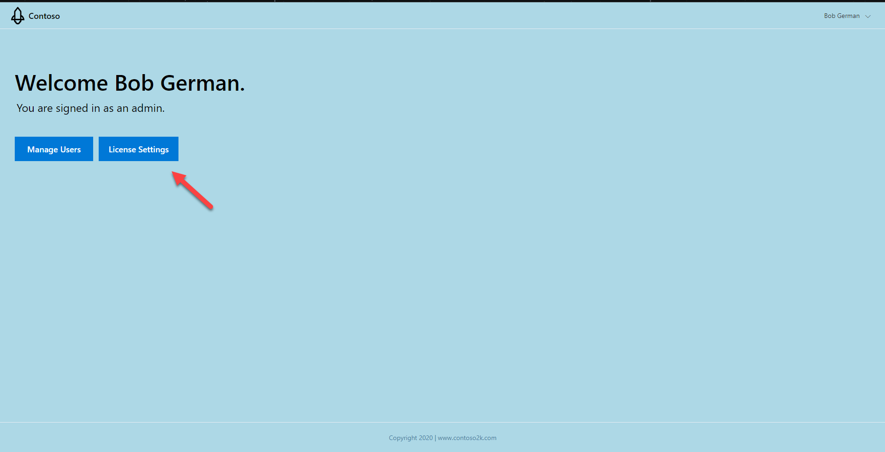

On this screen you can add individual user licenses using the "Add User" button, or you can set a policy that allows users to claim licenses on a first come, first served basis. Turn on the "First come first served" switch to enable this option.


Note that everything on this screen is defined by this application. It's intended to be flexible since our partners have a wide range of licensing approaches. Apps can tell who's logging in via Azure AD and use the user ID and tenant ID to authorize access, provide personalization, etc.

### Step 3: Run the application in Teams

Now that you've purchased a subscription, return to Microsoft Teams and refresh your application. The license will be checked and the user can interact with the application normally.

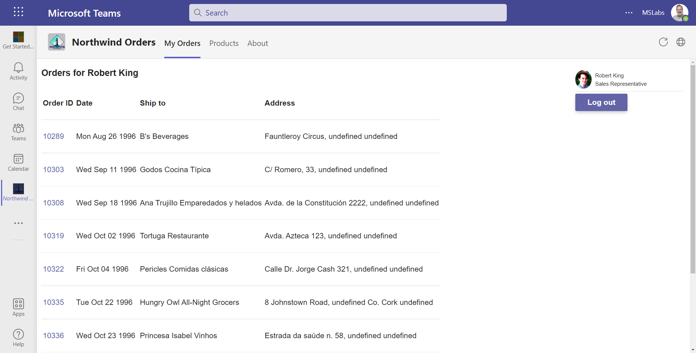

Now return to the licensing application. If you've closed the tab, you can find it at https://(webAppSiteName).azurewebsites.net where (webAppSiteName) is the name you chose in Exercise 1 Step 3. 


Notice that your username has been assigned a license. The sample app stored this in a SQL Server database. When the Teams application called the licensing service, the access token contained the tenant ID and user ID, enabling the licensing service to determine that the user has a license.

## Known issues

For the latest issues, or to file a bug report, see the [github issues list](https://github.com/OfficeDev/m365-msteams-northwind-app-samples/issues) for this repository.

## Next steps

After completing this lab, you may continue with any of the following labs.

- [Add a Configurable Tab](./ConfigurableTab.md)
- [Add a Deep link to a personal Tab](./Deeplink.md)
- [Add Messaging Extension](./MessagingExtension.md)
- [Add a Task Module](TaskModules.md)