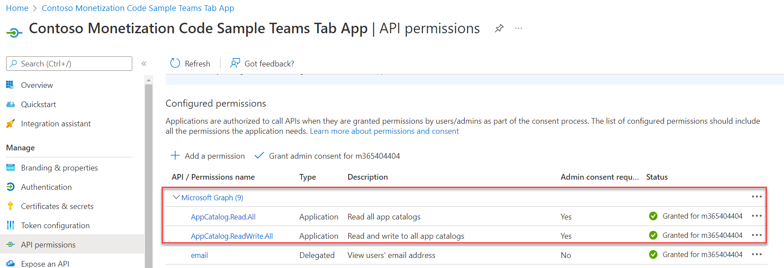

# Deep linking

## Summary

This sample is an enhancement of the personal tab created from using the core teams application built over the course of labs [A01](../../../../lab-instructions/aad/A01-begin-app.md)-[A03](../../../../lab-instructions/aad/A03-after-apply-styling.md).

In this sample, the student gets to explore deep linking in Microsoft Teams.

#### Copy the url to a particular order in `My orders` tab of the user. 

This link can then be shared via chat or email.


#### Another user can open this url to view the order details in their own personal tab.


## Version history

Version|Date|Author|Comments
-------|----|----|--------
1.0|March 2022|Rabia Williams|Initial release

## Disclaimer

**THIS CODE IS PROVIDED *AS IS* WITHOUT WARRANTY OF ANY KIND, EITHER EXPRESS OR IMPLIED, INCLUDING ANY IMPLIED WARRANTIES OF FITNESS FOR A PARTICULAR PURPOSE, MERCHANTABILITY, OR NON-INFRINGEMENT.**

---

## Minimal Path to Awesome

- Clone or download the sample from [https://github.com/OfficeDev/m365-msteams-northwind-app-samples](https://github.com/OfficeDev/m365-msteams-northwind-app-samples)

- In a console, navigate to `src/extend-with-capabilities/aad/Deeplink/` from the main folder `m365-msteams-northwind-app-samples`.

    ```bash
    cd src/extend-with-capabilities/aad/Deeplink/
    ```

- Install modules

    ```bash
    npm install
    ```

- Run ngrok - point to port 3978

    ```bash
    ngrok http -host-header=rewrite 3978
    ```

- Package the app

    ```bash
    npm run package
    ```

- Run the bot locally
    ```bash
    npm start
    ```

- Upload the the packaged zip file inside `manifest` folder into your organization's app store [using these instructions](https://docs.microsoft.com/en-us/MicrosoftTeams/upload-custom-apps).

> We need the app to be installed and available to all users to be able to use this particular lab.

#### Grant the Northwind Orders app permission to get team app Id

To deep link into the personal tab, we need the server generated app id, which is different to the TEAMS_APP_ID in the `.env` file.
We will use Microsoft Graph's [api](https://docs.microsoft.com/en-us/graph/api/appcatalogs-list-teamsapps?view=graph-rest-1.0&tabs=http#http-request) to get the id.

To do this, go to the Azure Active Directory where you have registered the teams application and add the needed `applicatio permission`.

The steps are similar to this [lab](https://github.com/OfficeDev/m365-msteams-northwind-app-samples/blob/main/lab-instructions/aad/A01-begin-app.md#step-3-grant-your-application-permission-to-call-the-microsoft-graph-api)

Select below "Application permissions" to add the required permission.

- AppCatalog.Read.All
- AppCatalog.ReadWrite.All

Grant admin consent. The page now looks like this.




## Features

User can share an order's link with their colleagues through email or chat. 

This link will directly take them to a personal tab with the order information displayed.

Use Microsoft Graph to get the teams app's server id.

## Debug and test locally

TBD